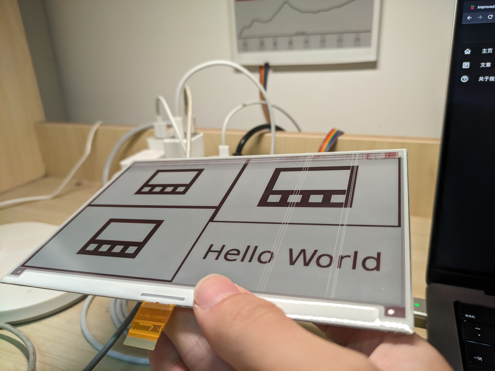
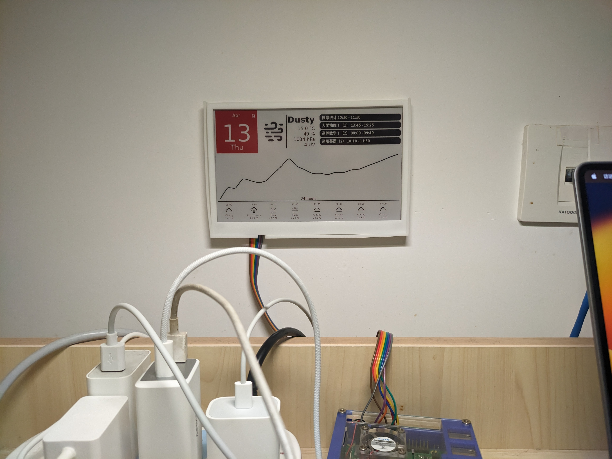

# 前情
> - 朋友： 我这有个树莓派3B，借你玩玩
> - 我：OK

然后放宿舍落了一万年灰。

再怎么说，这Linux开发板，还是arm架构的，放着落灰，是不是有点浪费。我就做了这么个玩意。

# 我到底做了个啥

首先呢，你有一块屏幕，是电子墨水aka电纸的。这种屏幕有一个优点，断电之后能保持上面的内容。



但这种屏幕也有个缺点，刷新率比较低，差不多0.05Hz。

我想着，我要在上面画点东西，比如我放个网页在上面，是不是对这种屏不太友好，所以我写了个UI库，专门用来生成静态内容。

## EPUI

向你介绍，E-Paper User Interface，我为电纸屏设计的、完全可定制化的、最牛逼的绘图library。

<Repo id="zhufucdev/epui"/>

怎么说呢，画一些天气？

```python
from ui import *
from weather import *

canvas = Image.new('L', CANVAS_SIZE, 255)
context = Context(ImageDraw.Draw(canvas), CANVAS_SIZE)
weather_api_provider = CaiYunAPIProvider(
    api_key='you will never know',
    location=Location(
        latitude=3.1415926,
        longitude=2.7182818
    )
)
weather_provider = CaiYunWeatherProvider(
    weather_api_provider
)

context.root_group.add_view(
    LargeWeatherView(
        context,
        provider=weather_provider
    )
)

context.redraw_once()
canvas.show()
```

向你介绍，南京天气



向你介绍：调试模式

```diff
+ View.draw_bounds_box = True
canvas = Image.new('L', CANVAS_SIZE, 255)
context = Context(ImageDraw.Draw(canvas), CANVAS_SIZE)
```


看到没？组合式UI框架，就是牛逼。

# 技术
不是所有人都在乎技术。如果你是个nerd，可以去看我的[仓库](https://github.com/zhufucdev/Diss)。我这里简单提两句

我把驱动和绘图分别抽象出来，好让显示器可以是任何东西，比如扫描仪。
此外，我用了一些彩云和Google日历的接口，好显示一些真的有用的东西。

我自己的评价是，整个代码库高度抽象，功能解偶。可以说，我已经拿捏python了。
