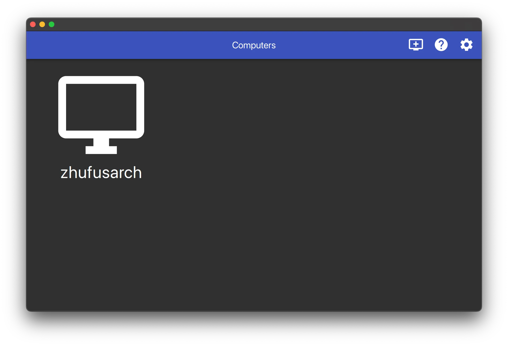
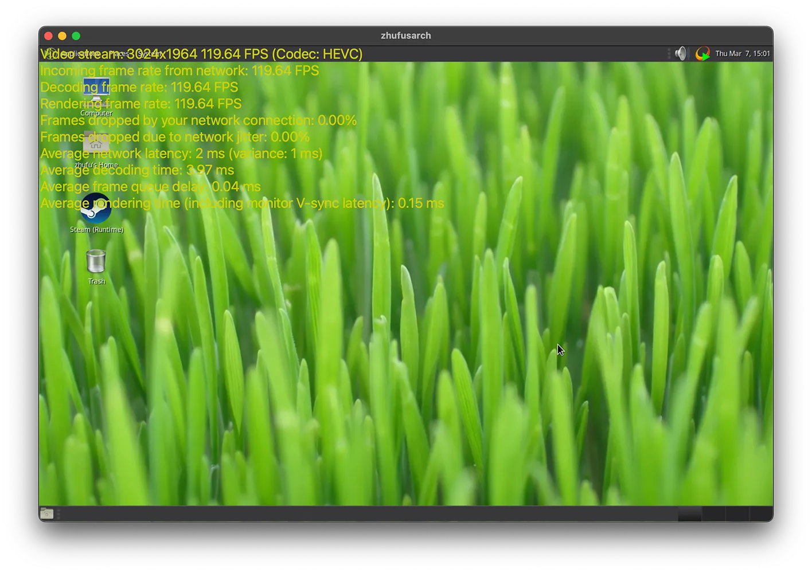

# 目标

- 网络（无线）串流桌面和游戏
- 不买显示器或显示诱导器
- 无人值守

# 前提条件

我假设机器里有一张**英伟达**显卡。我相信AMD显卡也可以用，唯一的问题是它不能做虚拟显示器，所以你不得不购买一个诱导器。

<HelperCard title="显示诱导器">
  也叫dummy
  plugs。它们假装自己是一个显示器，所以系统会从GPU渲染，而不是CPU模拟，比如`xserver-xorg-video-dummy`
</HelperCard>

我假设机器运行Arch Linux，只因为它是最牛逼的Linux发行版。

<HelperCard title="我不运行Arch Linux">
  如果你的机器不是Arch，我会建议你装一个
</HelperCard>

此外，我不假设机器连接有显示器、鼠标或键盘。Linux不需要这些东西。但我假设你的机器联网，因为很显然的缘故。

## 登录机器

你可以从SSH或tty登录机器。

## 安装软件和修改驱动

必须安装英伟达私有驱动。必须用Xorg而不是Wayland，因为虚拟显示器的关系。你大概率会需要一个桌面环境，这里我会选择Mate。

```shell
paru -S nvidia-utils xorg-init mate
```

<Details title="安装英伟达私有驱动">
  会需要nvbfc和nvenc。开源驱动不包含这些模块。关于安装本身，请移步[ArchWiki](https://wiki.archlinux.org/title/NVIDIA#Installation)
</Details>

基本上，英伟达消费者驱动屏蔽了nvbfc，所以Sunshine不能直接捕捉显存里面的画面。Arch
Linux牛逼的地方就是AUR，在那里轻松找到修改驱动的脚本。

```shell
# 启用nvbfc和解锁nvenc单元数量限制
paru -S nvidia-patch
```

## 验证驱动

通过`nvidia-smi`验证驱动是否工作。注意运行在GPU上的进程显示在`Processes`。

```log
zhufu@zhufusarch ~> nvidia-smi
Thu Mar  7 13:16:04 2024
+-----------------------------------------------------------------------------------------+
| NVIDIA-SMI 550.54.14              Driver Version: 550.54.14      CUDA Version: 12.4     |
|-----------------------------------------+------------------------+----------------------+
| GPU  Name                 Persistence-M | Bus-Id          Disp.A | Volatile Uncorr. ECC |
| Fan  Temp   Perf          Pwr:Usage/Cap |           Memory-Usage | GPU-Util  Compute M. |
|                                         |                        |               MIG M. |
|=========================================+========================+======================|
|   0  NVIDIA GeForce GTX 1080 Ti     Off |   00000000:29:00.0 Off |                  N/A |
| 27%   34C    P8             12W /  250W |     341MiB /  11264MiB |      0%      Default |
|                                         |                        |                  N/A |
+-----------------------------------------+------------------------+----------------------+

+-----------------------------------------------------------------------------------------+
| Processes:                                                                              |
|  GPU   GI   CI        PID   Type   Process name                              GPU Memory |
|        ID   ID                                                               Usage      |
|=========================================================================================|
|    0   N/A  N/A      1167      G   /usr/lib/Xorg                                 160MiB |
|    0   N/A  N/A      1170    C+G   sunshine                                      174MiB |
+-----------------------------------------------------------------------------------------+

```

# 配置Sunshine和虚拟显示器

## 阳光

先从简单的开始。从AUR下载Sunshine。

```shell
paru -S sunshine-bin
# 你也可以选择`sunshine`。那个包会从源码编译安装。
```

`sunshine`会被添加到PATH。我会从tmux运行，所以登出ssh的时候进程还活在那里。

```log
zhufu@zhufusarch ~> tmux
Welcome to fish, the friendly interactive shell
Type help for instructions on how to use fish
zhufu@zhufusarch ~> sunshine
[2024:03:07:13:29:03]: Info: Sunshine version: v0.22.0
[2024:03:07:13:29:03]: Warning: Failed to create system tray
[2024:03:07:13:29:03]: Error: Failed to create session: Unable to open display
[2024:03:07:13:29:03]: Error: Failed to gain CAP_SYS_ADMIN
[2024:03:07:13:29:03]: Error: Environment variable WAYLAND_DISPLAY has not been defined
[2024:03:07:13:29:03]: Error: Unable to initialize capture method
[2024:03:07:13:29:03]: Error: Platform failed to initialize
[2024:03:07:13:29:03]: Info: // Testing for available encoders, this may generate errors. You can safely ignore those errors. //
[2024:03:07:13:29:03]: Info: Trying encoder [nvenc]
[2024:03:07:13:29:04]: Info: Encoder [nvenc] failed
[2024:03:07:13:29:04]: Info: Trying encoder [vaapi]
[2024:03:07:13:29:04]: Info: Encoder [vaapi] failed
[2024:03:07:13:29:04]: Info: Trying encoder [software]
[2024:03:07:13:29:04]: Info: Encoder [software] failed
[2024:03:07:13:29:04]: Fatal: Unable to find display or encoder during startup.
[2024:03:07:13:29:04]: Fatal: Please check that a display is connected and powered on.
[2024:03:07:13:29:04]: Error: Video failed to find working encoder
[2024:03:07:13:29:04]: Info: Adding avahi service Sunshine
[2024:03:07:13:29:04]: Info: Configuration UI available at [https://localhost:47990]
[2024:03:07:13:29:05]: Info: Avahi service Sunshine successfully established.
```

注意到`Configuration UI available at [https://localhost:47990]`。这其实是个谎言。Sunshine的Web
UI监听在`0.0.0.0:47990`，我的NAS主机名是zhufusarch，所以我可以在我的笔记本访问https://zhufusarch.local:47990
如果你的NAS和你不在同一个子网，你需要它的公网地址，或者从ssh端口映射，但这方面我不想讲太多。

在Web UI，

<HelperCard title="Attention!" variant="error">
Sunshine detected these errors during startup. We **STRONGLY RECOMMEND** fixing them before streaming.

- Fatal: Unable to find display or encoder during startup.

- Fatal: Please check that a display is connected and powered on.
  </HelperCard>

我们回头再解决这些错误。

## 月光

从[Moonlight Game Streaming: Play Your PC Game remotely](https://moonlight-stream.org)安装Moonlight。这一步发生在接收端。Moonlight支持很多平台，包括但不限于

- PC / Mac
- Android / iOS
- TV / Nintendo Switch?

## Xorg虚拟显示器

现代Xorg很聪明。它不需要nvidia-xconfig生成的模板，也可以让显示器和输入设备工作。但要让虚拟显示器工作，需要一些特殊的配置。以下是最小配置的模板。

```shell
zhufu@zhufusarch ~> cat /etc/X11/xorg.conf
Section "Device"
    Identifier     "Device0"
    Driver         "nvidia"
    VendorName     "NVIDIA Corporation"
    Option         "ConnectedMonitor" "DFP"
    Option         "UseDisplayDevice" "DFP"
    Option         "AllowEmptyInitialConfiguration" "True"
    Option         "NoPowerConnectorCheck" "True"
    Option         "ModeValidation" "NoDFPNativeResolutionCheck,NoVirtualSizeCheck,NoMaxPClkCheck,NoHorizSyncCheck,NoVertRefreshCheck,NoWidthAlignmentCheck AllowNonEdidModes"
EndSection

Section "Screen"
    Identifier  "nvidiascreen"
    Device      "Device0"
    Option      "ConnectedMonitor" "DP-0"
    SubSection  "Display"
        Modes     "2400x1500"
    EndSubSection
EndSection
```

`"DP-0"`是GPU任意一个输出接口的标识符。大概率会是DP-X或者HDMI-X。如果他们都不工作，唯一能做的事情就是真的连接一个显示器或者诱导器、启动X服务器、查看可用的接口。

```log
zhufu@zhufusarch ~> paru -S xterm
zhufu@zhufusarch ~> startx &
zhufu@zhufusarch ~> xrandr
Screen 0: minimum 8 x 8, current 2268 x 1473, maximum 32767 x 32767
DVI-D-0 disconnected (normal left inverted right x axis y axis)
HDMI-0 disconnected (normal left inverted right x axis y axis)
DP-0 disconnected (normal left inverted right x axis y axis)
DP-1 disconnected (normal left inverted right x axis y axis)
DP-2 disconnected (normal left inverted right x axis y axis)
DP-3 disconnected (normal left inverted right x axis y axis)
DP-4 disconnected (normal left inverted right x axis y axis)
DP-5 disconnected (normal left inverted right x axis y axis)
```

## 配置xinit

先从etc获取一个模板，

```shell
cp /etc/X11/xinit/xinitrc ~/.xinitrc
```

我希望串流的时候能有一个桌面，就像远程桌面一样。我使用Mate。它的配置需是在xinitrc的末尾加上启动指令。

```shell
echo 'exec mate-session' >> ~/.xinitrc
```

<HelperCard title="我不运行Mate">
  [Desktop environment -
  ArchWiki](https://wiki.archlinux.org/title/Desktop_environment)
  里，找到你DE的词条，里面应该会有它配置initx的方法。
</HelperCard>

# 启动Sunshine

## 提高权限

需要修改/dev/uinput和/dev/dri/cardX的权限，因为Udev在无人值守情况下工作方式的问题。这很臭，但没有更好的办法，至少我想不到。

```shell
sudo chown $(id -nu):$(id -ng) /dev/uinput
sudo chown $(id -nu):$(id -ng) /dev/dri/card*
```

不得不启用sudo
nopasswd，因为重启系统会重置这些文件的权限。你也可以将这两条指令作为脚本，单独给它nopasswd权限，这听起来更安全。

```shell
echo "${USER} ALL=(ALL:ALL) ALL, NOPASSWD: $(pwd)/sunshine-setup.sh" \
  | sudo tee /etc/sudoers.d/${USER}
```

此外，Xorg也设有权限门限。需要为普通用户开启root的功能。

```shell
zhufu@zhufusarch ~> cat /etc/X11/Xwrapper.config
allowed_users = anybody
needs_root_rights = yes
```

## 手动运行桌面和串流服务器

从命令行启动xserver和sunshine。现在，Sunshine可以利用nvenc编码器。

```log
zhufu@zhufusarch ~> startx &
zhufu@zhufusarch ~> sunshine
[2024:03:07:14:42:58]: Info: Sunshine version: v0.22.0
[2024:03:07:14:42:58]: Info: System tray created
-- snippt --
[2024:03:07:14:43:01]: Info: // Ignore any errors mentioned above, they are not relevant. //
[2024:03:07:14:43:01]: Info:
[2024:03:07:14:43:01]: Info: Found H.264 encoder: h264_nvenc [nvenc]
[2024:03:07:14:43:01]: Info: Found HEVC encoder: hevc_nvenc [nvenc]
[2024:03:07:14:43:01]: Info: Adding avahi service Sunshine
[2024:03:07:14:43:01]: Info: Configuration UI available at [https://localhost:47990]
[2024:03:07:14:43:01]: Info: Avahi service Sunshine successfully established.
```

在Moonlight，可以看到电脑和它的主机名，在我的例子里，zhufusarch。


连接桌面，测试可用性。用Control - Option - Shift - S查看帧率等。


## 无人值守

需要修改loginctl的配置，所以不ssh登录也能让sunshine和xorg活着。

```shell
sudo loginctl enable-linger $(id -nu)
```

找一个放用户脚本的地方，因为要用三个脚本。我喜欢放在`~/.local/share/scripts`里。

```shell
zhufu@zhufusarch ~> mkdir -p ~/.local/share/scripts && cd ~/.local/share/scripts
zhufu@zhufusarch ~> vim virtdisplay.sh
#!/bin/bash
dbus-launch

# Check existing X server
ps -e | grep X >/dev/null
[[ ${?} -ne 0 ]] && {
 echo "Starting X server"
 startx
} || echo "X server already running"

```

```shell
zhufu@zhufusarch ~> vim sunshine.sh

#!/bin/bash

sudo $HOME/.local/share/scripts/sunshine-setup.sh
echo "Starting Sunshine!"
sunshine

```

```shell
zhufu@zhufusarch ~> echo "sudo chown $(id -nu):$(id -ng) /dev/uinput \
&& sudo chown $(id -nu):$(id -ng) /dev/dri/card*" > sunshine-setup.sh
zhufu@zhufusarch ~> chmod +x *.sh
```

创建用户态systemd单元，所以xorg和sunshine可以随系统启动。

```log
zhufu@zhufusarch ~> systemctl --user edit --full --force xorg-virtdisplay
[Unit]
Description=Xorg virutal display

[Service]
ExecStart=/home/zhufu/.local/share/scripts/virtdisplay.sh
Type=simple

[Install]
WantedBy=default.target
```

```shell
zhufu@zhufusarch ~> systemctl --user edit --full sunshine
[Unit]
Description=Sunshine is a self-hosted game stream host for Moonlight.
StartLimitIntervalSec=500
StartLimitBurst=5
Wants=xorg-virtdisplay.target
After=xorg-virtdisplay.target

[Service]
ExecStart=/home/zhufu/.local/share/scripts/sunshine.sh
Restart=on-failure
RestartSec=5s
Environment=DISPLAY=:0

[Install]
WantedBy=default.target
```

启用这两个单元。

```shell
systemctl --user enable --now xorg-virtdisplay sunshine
```

# 增加鲁棒性

## 问题

Sunshine在我的机器上不是最稳定的，四五次重新连接，它会panic。

```log
[2024:03:09:15:00:30]: Error: Couldn't set default-sink [auto_null]: No such entity
[2024:03:09:15:00:30]: Error: Couldn't destroy session handle: Unable to cleanup NvFBC
[2024:03:09:15:00:30]: Error: Couldn't release NvFBC context from current thread: Unable to cleanup NvFBC
[2024:03:09:15:00:30]: Error: CreateBitstreamBuffer failed: out of memory
```

我没有明确的证据，但我感觉这和硬件有关系。我只会写软件，所以这是我的解法。

## 太阳花

Sunflower用最顶尖的编程技术，让Sunshine变得强健。它的做法是，检测到Sunshine工作不正常，叫它重启。

<Repo id="zhufucdev/sunflower" />

触发重启的条件是：

- 输出中包含`CreateBitstreamBuffer failed: out of memory`
- 不能访问HTTP控制台

可以用以下命令编译Sunflower。

```shell
paru -S rustup
rustup default

git clone https://github.com/zhufucdev/sunflower
cd sunflower
cargo build --release
```

Sunflower是Sunshine的包装。在sunshine.sh中，调用sunflower作为替代。

```diff
#!/bin/bash

sudo $HOME/.local/share/scripts/sunshine-setup.sh
echo "Starting Sunshine!"
- sunshine
+ sunflower https://localhost
```

可以修改代码，让它贴合具体情况。
