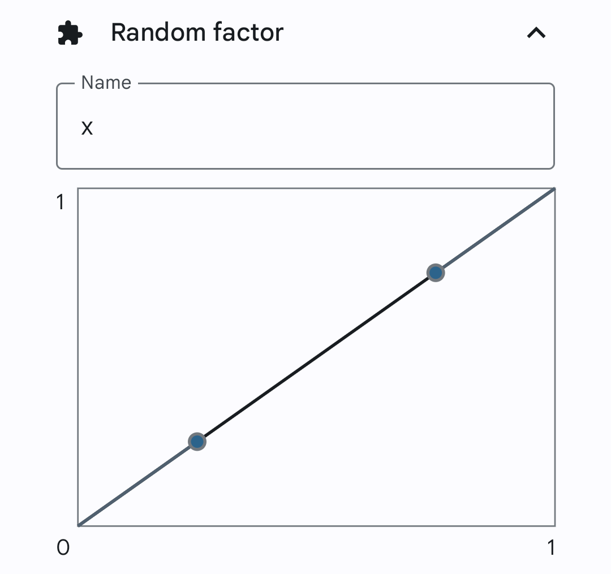

# About

Motion Emulator is an Xposed-based location mock app. It is superior to other apps in
support of:

- Sensor and telephony data collection and simulation
- Trace modification and salting
- Both root and non-root devices
- Map and coordiation system covertsation

<HelperCard title="Downloading method">
In this article, several downloading methods are provided. Choose according to your needs.
</HelperCard>

# Download
[GitHub Releases](https://github.com/zhufucdev/MotionEmulator/releases)
[OneDrive](https://nuistedu-my.sharepoint.cn/:f:/g/personal/202283270243_nuist_edu_cn/Ejuxvnw4-8xFh9HhibzqPqcB1wD09Qr48wvukFZzSiisig?e=1txPvb)

<HelperCard title="Release Note v1.2.2">

### Bugfix
- Crash when exporting (sharing) recorded data
- Visual bugs in Recording and Emulation UI
- Missing `navigate up` tooltip in Compose-based pages

</HelperCard>

<Details title="Release Notes for Previous Versions">

## Release Note `v1.2.1`

### Bugfix
- Failure dragging newly downloaded plugins
### Note for Blog users
From this version on, no plug-in will be included, as you can download them directly from the app

## Release Note `v1.2.0`

### Plug-in System

The newly introduced plug-in system makes Motion Emulator more powerful than ever.

- The main app itself is decoupled from Xposed.
- To implement full functionality, install Xposed-based plug-ins.
- You can get a list of available plug-ins in the Plug-in UI.
- Download, install and manage within clicks and gestures.

The power of plug-ins appears to be
- Flexibility: plug-ins can be optimized for certain apps, providing the best experience;
- Compatibility: host to module communication layer is separated from Motion Emulator, as a result of which special apps can be forged into the system;
- Management: specify different hooking methods per app;
- Advancement: different modules can be upgraded in parallel, fixing bugs and making improvement with ease.

### WebSocket-based Protocol

- Implementation of realtime communication between host app and module.
- ProtoBuf is used for improved efficiency.

### Better Emulation
- Severe bugs of v1.1.7, the last release, have been fixed.
- Because of the above changes, the Websocket Plugin carries the latest improvements.

</Details>

# Getting started

To get started with Motion Emulator, taking the following steps.

## Choose the Right Plug-in

Different plug-ins implement partial or full functionality of Motion Emulator in different ways. Choose it wisely.

|Name|Platform|Implementation|Support|Fake Location|Fake Sensor|Fake Cell Station|
|:--|:--|:--|:--|:--:|:--:|:--:|
|Mock Location Plugin|Stock Android|<Details variant="dialog">Websocket➡️Developer Options API</Details>|Apps that doesn't detect mock location|✅🅱️|❎|❎|
|Websocket Plugin|Xposed|<Details variant="dialog">Mixin➡️Websocket</Details>|Majority of apps|✅🅰️|✅|✅|
|Content Provider Plugin|Xposed|<Details variant="dialog">Mixin➡️ContentProvider➡️Websocket Forwarded</Details>|Majoriity of apps that target sdk version 30 or lower|✅🅰️|✅|✅|

## Plug-in Activation

In the app's main page, select `No Plug-ins Found` card. This will bring up the plug-in manager.

From the `DISABLED` list, click on a wanted plug-in to start downloading. After completion, permissions to install unknown apps may be required. The app will automatically make request and install the plug-in.

Drag and drop the installed plug-in to the `ENABLED` list to activate.

<HelperCard variant="warn" title="Plugin specific configurations">

Plug-ins which are based on Xposed requires additional configuration in the framework you are using. 

For the Mock Location Plugin, setup according to the contained instructions.

</HelperCard>


## Drawing Path

Back to the main page, select `Draw Trace` card. Within the first attempt, maps are to be configured.

<HelperCard title="Choose the right map">

Please choose according to your needs. If you don't know what you are doing, select Google Maps.

</HelperCard>

Note that the maps viewport is centered with your approximate position. Click on the `Add Trace` buttion on the bottom of the screen to start creating. Two methods are provided to draw the new path.

### Hand-painted

Move around the map to find an appropriate viewport. You can click on the search button on the top of the screen,
jumping to points of interests convinently.

To start hand drawing, select the `Draw Trace` button on the bottom of the screen, then select Opt. Then, interactions with the map would leave traces on the map, instead of moving the viewpoint.

To undo the last draw, click on the Undo button on the bottom of the screen. To erase the drawn path, click on the Clear button.

When the drawing is completed, click on the Done button on the bottom.

### GPS Sampled

To store real-world postions as path, click on the GPS Sample button on the bottom of the screen.

<HelperCard title="Seek signals">

Find a place where satellites are available, especially outdoor and open areas. The app starts recording when the signal is relatively OK.

</HelperCard>

To pause the record, click on the Pause button on the bottom of the screen. To continue, click on the Unpause button. To undo the path drawn since the last pause, click on the Undo button.

After completion, click on the Pause button, then the Done button.

## Start Simulation

Navigate back to the main page and select `Emulate` card. Configure the fields of trace, repeat count, velocity, etc. When you feel lucky, click on the `Start Emulation` button on the bottom of the screen.

# Using Sensor Data

## Start Recording

In the main page, choose the `Record` card. Select the demanded sensor types. Click on `Continue`. 
The app generates various charts of involved sensors. After finishing record, click on the `Stop` button on the bottom of the screen.
The app **drops** recorded data if not using the `Stop` button.

## The Right Data

Different apps come with different algorithms. If you don't know what you are doing, align to frequency of steps.
Navigate back to the main page and choose the `Manage` card. The record can be found in the `Sensor` page.
The velocity estimated from step frequency is supposed to be close to the target velocity of emulation.

<HelperCard title="Replay Method">
In replay, Motion Emulator processes the data in a specific way.
For records short in duration, same clips are repeated.
For records that don't align to target velocity, the clip is speeded up or down.
Such modifications may produce unusual data.
</HelperCard>

## Discussion

Sensor simulation is among the least tested functionalities.
Most apps don't have a powerful mechanism of detection.
On the contrary, powerful apps are better adapted specifically.

# Making Traces Random

In the main page, select the `Manage` card. Navigate to `Traces` page. Select the trace to be edited. In the `RANDOM FACTOR` column,
click on Add, then Random Factor.



The way the graph works is that given a random point on the x axis, the corrsponding y
coordination is the calculation result.

<Details title="Graph Samples">


<p style={{textAlign: 'center'}}>Random factor x is more likely to approach 0 or 1</p>


<p style={{textAlign: 'center'}}>Random factor x is more likely to approach 0.5</p>
</Details>

In `Adding salt` popover, choose the demanded transform from rotate, scale and translate.

## Rotation

Select Rotation from the `Adding salt` popover. Expand this transform. Click on the Σ button
on the right, then click Use input. Type the following text in the `radian` input.

```plain
2 * pi * x
```

<HelperCard title="Reasoning">
In radian, 2π is one circumference. x ranges in [0, 1]. This random transform rotates the trace around at most.
</HelperCard>

## Translation

Select Translation from the `Adding salt` popover. Expand this transform. Type the following text in both
the `x` and `y` inputs.

```plain
x * 10 ^ -4
```

<HelperCard title="Reasoning">
^ stands for exponential operation, 10 ^ -4 is ten to the power of minus four.
This random transform translates the trace for ten to the power of minus four in the latitude direction.
</HelperCard>

## Rotation

Choose Scale from the `Adding salt` popover. Expand this transform. Type the following text in
the `x ratio` input.

```plain
e ^ -x
```

<HelperCard title="Reasoning">
e is the base of the natural logarithm. This is just for fun.
</HelperCard>


