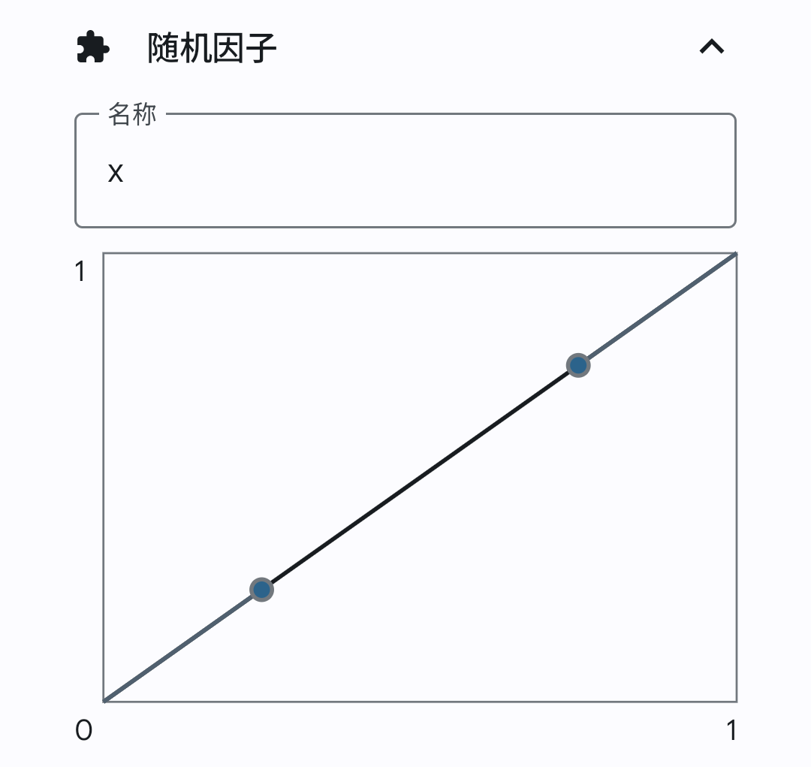
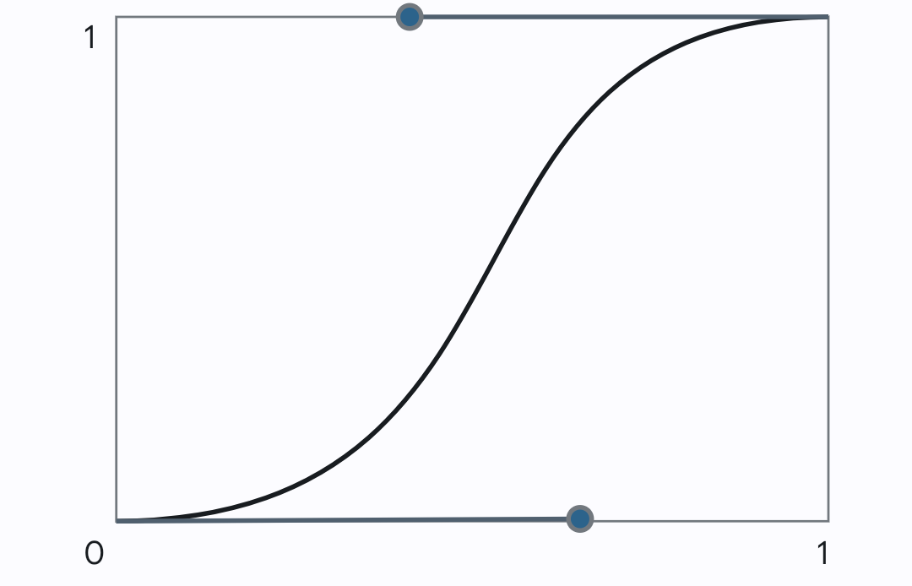
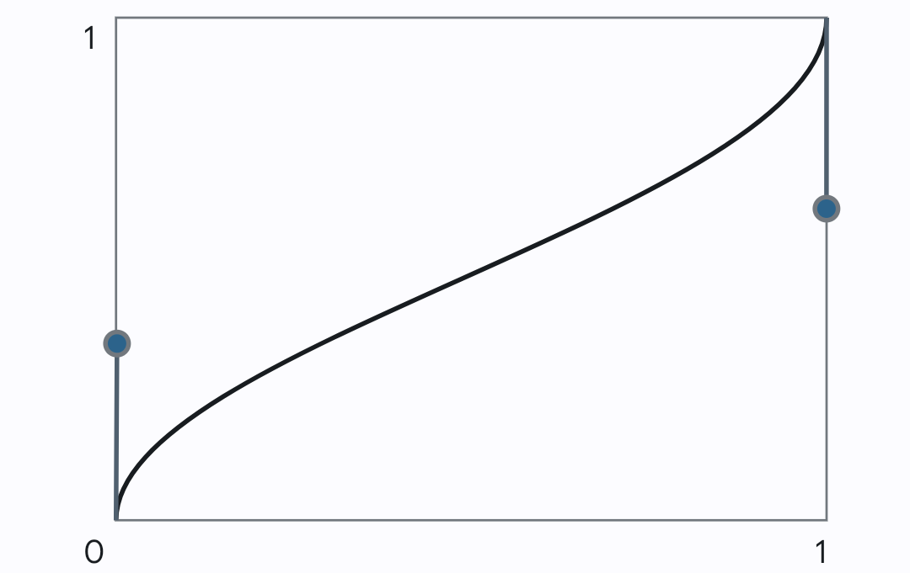

# 說明

運動模擬器是基於 Xposed 框架的定位模擬應用程式。它勝過其他應用程式的點在於對以下功能的支援：

- 感應器和基地台數據的收集和模擬
- 路徑修改和混淆
- 同時對 root 和非 root 裝置的支援
- 地圖和座標系轉換

<HelperCard title="下載">
  此文章提供了幾種下載方式，你可以決定從哪個連結下載。
</HelperCard>

# 開始下載

[GitHub Releases](https://github.com/zhufucdev/MotionEmulator/releases)
[OneDrive](https://nuistedu-my.sharepoint.cn/:f:/g/personal/202283270243_nuist_edu_cn/Ejuxvnw4-8xFh9HhibzqPqcB1wD09Qr48wvukFZzSiisig?e=1txPvb)

<HelperCard title="版本說明 v1.2.2">
### 錯誤修復
- 匯出（分享）已記錄的數據時當機
- 記錄介面和模擬介面的視覺錯誤 
- 在基於 Compose 的頁面中缺少 `導覽到上一層級` 的提示
</HelperCard>

<Details title="舊版本的版本說明">

## 版本說明 `v1.2.1`

### 錯誤修復

- 無法拖曳剛下載的插件。

### 給部落格使用者的通知

從這個版本開始，將不包含其他插件，因為可以從主程式下載。

## 版本說明 `v1.2.0`

### 插件系統

新加入的插件系統讓運動模擬器功能更加強大。

- 主應用程式從 Xposed 解耦，不再是 Xposed 模組。
- 基於 Xposed 的插件實現了完整功能。
- 在插件介面可以找到所有可用插件。
- 下載、安裝和管理插件的方法十分簡單，只需幾個點擊和手勢。

插件的能力體現在

- 靈活性：插件可以為特定應用程式優化，以提供最佳體驗；
- 相容性：主程式與模組之間的通訊層與運動模擬器本身分離，因而特殊應用程式也可以被納入這一體系；
- 先進性：不同模組平行更新，從容修復 bug，提供改進。

### 基於 WebSocket 的協定

- 實現了主程式與模組的即時通訊。
- 使用了高效的 ProtoBuf 協定。

### 更好的模擬

- 修復了上一個版本（v1.1.7）的嚴重 bug。
- 鑑於以上更改，Websocket 插件實現了最新的改進。

</Details>

# 開始使用

要開始使用運動模擬器，只需以下幾個步驟。

## 選擇合適的插件

不同插件以不同的方式實現運動模擬器的部分或全部功能。根據條件選擇合適的插件。

| 插件名         | 平台         | 實現方式                                                                   | 適用於                              | 位置模擬 | 感應器模擬 | 基地台模擬 |
| :------------- | :----------- | :------------------------------------------------------------------------- | :---------------------------------- | :------: | :--------: | :--------: |
| 模擬位置插件   | 原生 Android | <Details variant="dialog">Websocket➡️開發人員選項</Details>                | 不屏蔽模擬位置的應用程式            |   ✅🅱️   |     ❎     |     ❎     |
| Websocket 插件 | Xposed       | <Details variant="dialog">Mixin➡️Websocket</Details>                       | 大部分應用程式                      |   ✅🅰️   |     ✅     |     ✅     |
| 內容提供者插件 | Xposed       | <Details variant="dialog">Mixin➡️ContentProvider➡️Websocket 轉發</Details> | 大部分目標 SDK 不高於 30 的應用程式 |   ✅🅰️   |     ✅     |     ✅     |

## 啟動插件

在軟體主介面，選擇 `找不到插件` 卡片，進入插件管理器。

從 `已停用` 列表中，點擊需要的插件，開始下載。下載完成後，可能需要給予軟體安裝未知應用程式的權限。軟體會自動要求安裝下載好的插件。

將插件拖放到 `已啟用` 列表，啟動該插件。

<HelperCard title="插件指定設定" variant="warn">
基於 Xposed 的插件需要在你使用的框架中進行額外設定。

模擬位置插件需要按照內部的提示進行額外設定。

</HelperCard>

## 繪製路徑

回到主介面。選擇 `繪製路徑` 卡片。第一次使用，需要設定地圖選項。

<HelperCard title="選擇合適的地圖">
請根據實際需求選擇，沒有特殊偏好，請選擇Google Maps
</HelperCard>

注意，地圖已以你的粗略位置為中心。點擊螢幕下方的 `新路徑` 按鈕，開始路徑建立。軟體提供兩種方法繪製新路徑。

### 手繪

不妨移動地圖，尋找大致區域。可以點擊螢幕上方的搜尋按鈕，快速跳轉到興趣點。

要開始手繪路徑，選擇螢幕下方的 `繪製路徑` 按鈕，然後點擊 `選擇`。與地圖互動將不能移動地圖，而是在地圖上留下痕跡。

需要復原上一次操作，點擊螢幕下方的復原按鈕。需要清除路徑，點擊清除按鈕。

繪製完成後，點擊螢幕下方的返回按鈕。

### GPS 採樣

要記錄實際位置為路徑存檔，點擊螢幕下方的 GPS 採樣。

<HelperCard title="尋找訊號">

找到衛星訊號較好的地點，通常是戶外開闊地。軟體將在訊號較優時開始記錄。

</HelperCard>

要暫停記錄，點擊螢幕下方的暫停按鈕。要恢復記錄，點擊繼續按鈕。要復原至上次暫停的狀態，點擊復原按鈕。

完成記錄後，點擊暫停按鈕，然後點擊返回按鈕。

## 開始模擬

回到主介面。選擇 `模擬` 卡片。根據需要，設定路徑、重複次數、速度等參數。在對設定感到自信之後，點擊螢幕下方的 `開始模擬` 按鈕。

# 使用感應器數據

## 開始記錄

在主介面，選擇 `記錄` 卡片。選擇需要的感應器類型。點擊 `繼續`。軟體產生使用的感應器對應的圖表。在記錄完成後，點擊螢幕底部的 `停止` 按鈕。不使用停止按鈕而直接返回上一介面，將**捨棄**記錄好的數據。

## 合適的數據

不同軟體演算法不同。如果你不知道自己在做什麼，通常以步頻為標準。
回到首頁，選擇 `管理` 卡片，在 `感應器` 頁面可以找到記錄。步頻的估計速度應接近模擬時的目標速度。

<HelperCard title="重播方式">
  重播時，運動模擬器對數據有特殊處理。對於時間不夠長的記錄，將重複已有片段。對與目標速度不匹配的步頻，將加速或減速該片段。這樣的操作可能產生不自然的數據。
</HelperCard>

## 討論

感應器模擬是經過最少測試的功能。大部分軟體的檢測手段不是很強。相反，手段強的軟體最好做專門的適配。

# 給路徑添加隨機性

在主介面，選擇 `管理` 卡片。導覽到 `路徑` 頁面。選擇要編輯的路徑。在 `隨機因子` 中，點擊新建，選擇隨機因子。
展開新建的隨機因子。隨機因子的名稱是任何不含空格的字母組合。因子的圖像反應其結果的機率分佈。



圖像的工作方式是，在橫軸隨機選擇一個點，在曲線上對應的縱座標就是計算結果。

<Details title="圖像舉例">



<p style={{ textAlign: "center" }}>隨機因子 x 的計算結果更容易達到 0 或 1</p>



<p style={{textAlign: 'center'}}>隨機因子 x 的計算結果更容易達到 0.5</p>
</Details>

點擊 `新建`，在旋轉、縮放和平移中選擇需要的轉換。

## 旋轉

從 `加鹽` 選單中選擇旋轉。展開該轉換。點擊右側的 Σ 按鈕，選擇使用輸入。
在 `弧度制角度` 輸入框內，輸入以下文本。

```plain
2 * pi * x
```

<HelperCard title="為什麼">
  pi = π，* = ×；在弧度制角度中，2π 是一週。x 的範圍是 [0,
  1]。這個隨機轉換至多讓路徑旋轉一週。
</HelperCard>

## 平移

從 `加鹽` 選單中選擇平移。展開該轉換。在 `x` 和 `y` 輸入框內輸入以下文本。

```plain
x * 10 ^ -4
```

<HelperCard title="為什麼">
^ 是指數運算子。10 ^ -4
表示十的負四次方。這個隨機轉換至多讓路徑沿緯線方向平移十的負四次方度。
</HelperCard>

## 縮放

從 `加鹽` 選單中選擇縮放。展開該轉換。在 `x 軸比例` 中輸入以下內容。

```plain
e ^ -x
```

<HelperCard title="為什麼">e 是自然對數的底數。這樣做只是好玩。</HelperCard>

# 貢獻程式碼

## 複製專案

從 GitHub 複製專案原始碼。

```shell
git clone https://github.com/zhufucdev/MotionEmulator
```

`main` 為開發分支，在達到穩定後合併進 `stable`。不接受提交至 `stable` 分支的 Pull Request。

## 下載和設定 Android Studio

這個專案十分激進。最新的 Android Studio Canary 被用來編寫和偵錯這個專案。你可以從 [Android Developers](https://developer.android.com/studio/preview) 獲得一份它的副本。請安裝最新的編譯工具和 SDK。下表是經過測試的工具版本。

| 名稱            | 版本號                                  |
| :-------------- | :-------------------------------------- |
| Android Studio  | Android Studio Iguana 2023.2.1 Canary 1 |
| SDK Build Tools | 34                                      |
| SDK Platforms   | 34 revision 2                           |
| JDK             | Amazon Corretto 17                      |

## 設定專案

用 Android Studio 打開複製的專案。如果沒有自動同步，點擊右上角的 `Sync Project with Gradle Files` 按鈕。

### 環境變數

在根目錄下新建 local.properties。所需欄位如下表所示。

| 名稱         | 格式             | 說明                                                                                                                                                                                             |
| :----------- | :--------------- | :----------------------------------------------------------------------------------------------------------------------------------------------------------------------------------------------- |
| sdk.dir      | 檔案系統路徑     | <div class="flex items-center">Android SDK 資料夾根目錄 <Details title="該值是選填的" variant="dialog" inline>可以不填寫此欄位，當且僅當設定了 `ANDROID_HOME` 環境變數作為替代。</Details></div> |
| amap.web.key | 32 位十六進位數  | 高德地圖 Web API 金鑰·[文件](https://lbs.amap.com/api/webservice/summary/)                                                                                                                       |
| AMAP_SDK_KEY | 32 位十六進位數  | 高德地圖 Android SDK 金鑰·[文件](https://lbs.amap.com/api/android-sdk/summary/)                                                                                                                  |
| GCP_MAPS_KEY | /[a-zA-Z0-9_]\*/ | Google 地圖 SDK 金鑰·[文件](https://developers.google.com/maps/documentation/android-sdk/cloud-setup)                                                                                            |

<Details title="我不想申請金鑰" sx={{ mt: 2 }}>
  將各金鑰值留空，可以通過編譯。通常不建議這麼做，除非你知道自己在做什麼。
</Details>

### 更新服務（可選）

運動模擬器主程式和模擬位置插件具有自檢查更新功能。如果你希望發佈自己的運動模擬器發行版，可自建伺服器。在 app 和 mock_location_plugin 目錄下建立 server.properties。填入以下欄位。

| 名稱       | 格式       | 說明                                              |
| :--------- | :--------- | :------------------------------------------------ |
| PRODUCT    | 無空格字串 | 用於自索引的專案 ID                               |
| SERVER_URI | HTTP URL   | 伺服器位址。專案使用的 Ktor 僅支援 HTTP(S) 協定。 |

要自建伺服器，就要實現特定的 RESTful API。參考我的實現。

<Repo id="zhufucdev/api.zhufucdev" provide="github" />

# 程式碼規範及注意事項

在提交前，至少在推送前，請留意 IDE 的警告，特別是對多餘匯入 (unused import directive) 的警告。

請保持提交的程式碼被正確格式化。統一使用 4 空格縮排。單行 100 字元。禁止大量無意義空行。

如果有破壞性更改 (breaking changes)，例如修改了 stub API 的參數，請修改或添加文件。

接受大規模重構，當且僅當新的實現更加規範或便於維護。

<HelperCard title="大規模重構">
  大規模重構，是指重新實現了應用程式框架，因為原先的框架不是最佳實踐。前端的大規模重構可能是改變了主頁面的整理方式。後端的大規模重構可能是重新實現了通訊橋。
</HelperCard>

## 單元測試

該專案對單元測試沒有強制要求。僅在自動化比手動測試節省時間時編寫和執行測試，例如行程間通訊。該專案不以單元測試的通過率為標準評價 Pull Request 的品質。

## 介面設計

請遵循 [M3 設計指南](https://m3.material.io)。盡可能使用 Jetpack Compose 編寫新頁面。UI 美觀，UX 流暢、符合直覺。

請使用 ViewModel 或遵循其設計模式 (designing pattern)，注意資源回收、作用域和生命週期。

頁面相關的檔案，整理在 .ui 套件下。一個 Activity 衍生的不同 Fragment 或 Composable，整理在同一子目錄下。

## 擴充函式

避免使用全域擴充。請使用 DSL 模式限制作用域。

<HelperCard title="Do" variant="success">
```kotlin
fun String.toInt(): Int {...}
```
</HelperCard>

<HelperCard title="Don't" variant="error">
```kotlin
fun parseInt(str: String): Int {...}
```
</HelperCard>

將相關的擴充整理在同一個檔案。避免 Utility.kt。
