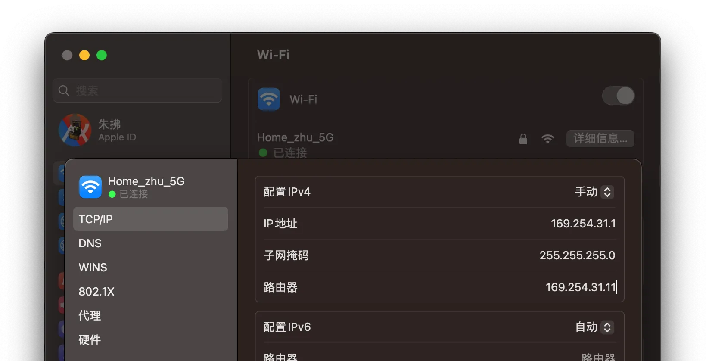
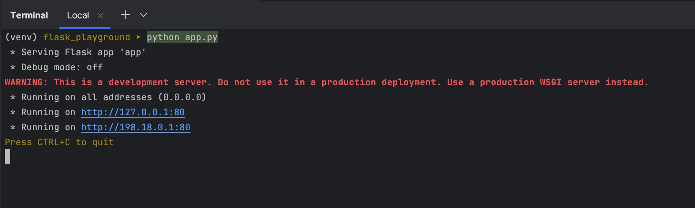
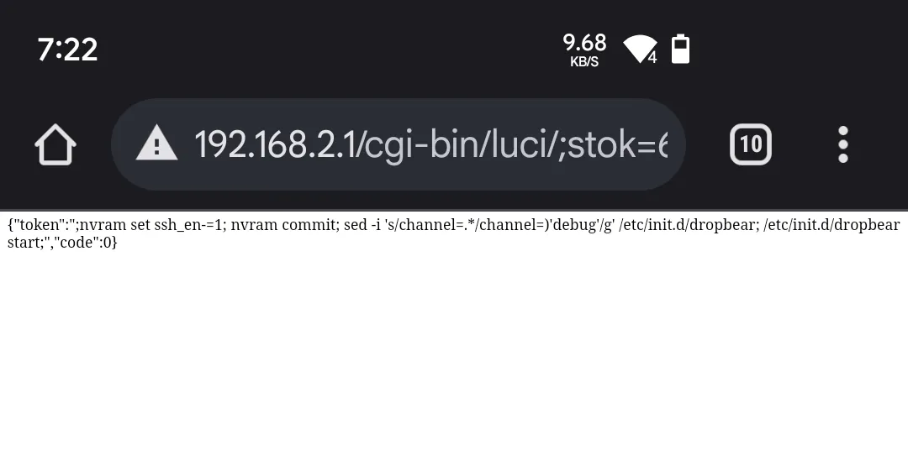
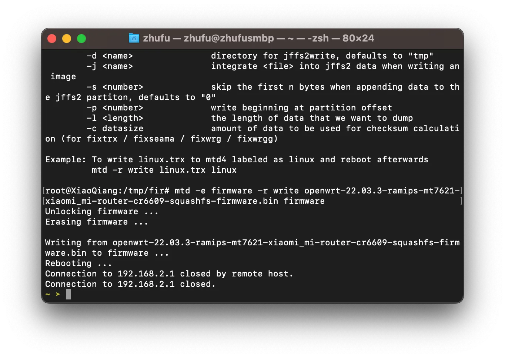

OpenWrt 是什麼？你問。

想像刷機之於 Android，就像是軟路由之於路由器。

課金可以解決的問題，為什麼要玩機呢？不知道。

# 準備

- 一台 M1 Pro 的 MacBook Pro，有你喜歡的 http serving 環境
- 一台 CR6609，閒魚一百人民幣以內入手（沒給我電源，這傢伙...）
- 你用了一萬年的老路由器
- 手機，要支援 Wi-Fi 上網的型號
- 你的 ROM，如果不確定，[這裡](https://openwrt.org/toh/hwdata/xiaomi/xiaomi_mi_router_cr6609)有一個連結

我不想用原版 ROM，你說。那你或許會想看我的這個repo，用 Docker 來跑 LEDE 編譯器

<Repo id="zhufucdev/lede_compiler" />

# 開幹

我喜歡先搞軟的，準備一些 Python 程式碼

```python
import json

from flask import Flask
from flask import request

app = Flask(__name__)

res = {
    "code": 0,
    "token": ';nvram set ssh_en=1; nvram commit; sed -i \'s/channel=.*/channel="debug"/g\' /etc/init.d/dropbear; '
             '/etc/init.d/dropbear start;'
}


@app.route('/cgi-bin/luci/api/xqsystem/token', methods=['POST', 'GET'])
@app.route('/cgi-bin/luci/api')
@app.route('/cgi-bin/luci/api/xqsystem')
def hello_world():
    if request.method == 'POST':
        print(request.form)

    return json.dumps(res)


if __name__ == '__main__':
    app.run(host='0.0.0.0', port=80)

```

我不喜歡 Python。你說。

隨你，你想用 Node、Deno 還是什麼 Brainfuck 都可以，開心就行。

## 思路

小米路由器有個**一鍵換機**功能，非常實用。透過偽造被換機的路由器，可以注入腳本，解鎖 SSH。

正常情況下，換機的流程大概是：

1. 新機 A 與舊機 B 透過一些方法握手
2. B 關閉 DHCP，將閘道改為 `169.254.31.1`，提供（serve）數據
3. A 連接 B 的熱點，抓取不知道什麼東西，包括一些明文腳本
4. 等待重啟

我們的操作空間在第 2、3 步。

## 偽造被換機路由器

啟動你用了一萬年的老路由器，進入後台，關閉 Wi-Fi
4/5 二合一（如果有的話），關閉 DHCP，並把閘道改成比如 `169.254.31.11`。

用 MacBook 連接，修改靜態 IP 到 `169.254.31.1`。


啟動你喜歡的 http 伺服器，注意監聽 `0.0.0.0:80`，別只顧著自己玩（localhost）。



## 破解

掏出你 Wi-Fi 上網的手機，連接 CR6609，用瀏覽器存取比如
`192.168.2.1`（或者其他閘道，你自己看）。

輸入管理員密碼（寫在路由器背面，或許你改過），注意瀏覽器網址列，有以
`http://192.168.2.1/cgi-bin/luci/;stok=` 開頭的東西，`=` 到下一個 `/`
中間是明文 Token（非常超強的設計 btw），記下來。

再開一個瀏覽器分頁，編輯網址：

```plain
http://192.168.2.1/cgi-bin/luci/;stok=∂/api/misystem/extendwifi_connect?ssid=ß&password=µ
```

其中：

| 標記 | 含義                          |
| :--: | :---------------------------- |
|  ∂   | 剛剛記下的明文 Token          |
|  ß   | 用了一萬年的老路由器的熱點 ID |
|  µ   | 對應的 Wi-Fi 密碼             |

過個 10s，順利的話，CR6609 就連上了老路由器，頁面會顯示一坨 JSON，其中有
`"code": 0`。

如果沒有，得再想想 DHCP 有沒有關閉，熱點 ID、密碼錯沒錯，還有沒有其他設備連著，試試 Wi-Fi
4 熱點，或許相容性會好點。

接著，編輯網址：

```plain
http://192.168.2.1/cgi-bin/luci/;stok=∂/api/xqsystem/oneclick_get_remote_token?username=ß&password=ß&nonce=ß
```

其中，∂ 還是那個明文 Token，ß 無所謂填什麼。

順利的話，會顯示類似這樣的東西（不完全是，但至少有 `"code": 0`）：


觀察 Mac 的控制台，會有 CR6609 的存取記錄。順便說一句，Python 程式碼裡，`token`
就是注入的腳本：

```shell
nvram set ssh_en=1
nvram commit
sed -i \'s/channel=.*/channel="debug"/g\'
/etc/init.d/dropbear
/etc/init.d/dropbear start
```

這個腳本做的事情，基本就是開個 dropbear 服務（輕量無頭的 SSH）。不出意外，服務已經在執行了，可以 SSH 進路由器了。

恭喜🎉

## 連接

把 MacBook 換回 DHCP，連上 CR6609 的熱點，執行：

```shell
$ ssh root@192.168.2.1 # 或者其他什麼閘道，你知道的
```

如果出錯：

```plain
Unable to negotiate with 192.168.2.1 port 22: no matching host key type found. Their offer: ssh-rsa
```

修改 ~/.ssh/config：

```shell
$ vim ~/.ssh/config

HostKeyAlgorithms ssh-rsa
PubkeyAcceptedKeyTypes ssh-rsa

:wq
```

應該可以連接了。

root 密碼，CR6609 就寫在背面，6606 跟 6608 據說要用什麼 SN 算，我也搞不清楚。

## 刷入

可以把 ROM 放到 http server 的 static 目錄下（或許你沒有）。

看一下 MacBook 的 IP，比如說 `Ω`，再看一下 ROM 的檔名，比如 `ß`，在路由器執行：

```shell
cd /tmp
curl -O http://Ω/static/ß
nvram set boot_wait=on ; nvram set bootdelay=3
nvram set flag_try_sys1_failed=0 ; nvram set flag_try_sys2_failed=1
nvram commit
mtd -e firmware -r write ß firmware
```



大功告成，等待重啟，希望你玩得開心🤘

# 參考

- [[原創]紅米 AX6 SSH 解鎖和掛載 overlay 方法](https://www.right.com.cn/forum/forum.php?mod=viewthread&tid=4060726)
- [OpenWRT 21.02.0-rc1 原版 for 小米 CR6606 / CR6608 / CR6609](https://www.right.com.cn/forum/thread-4112402-1-1.html)
