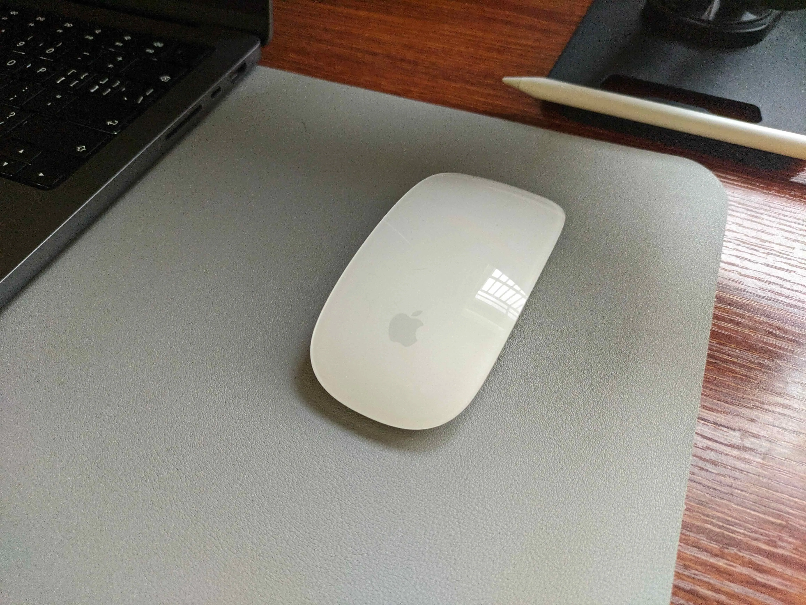
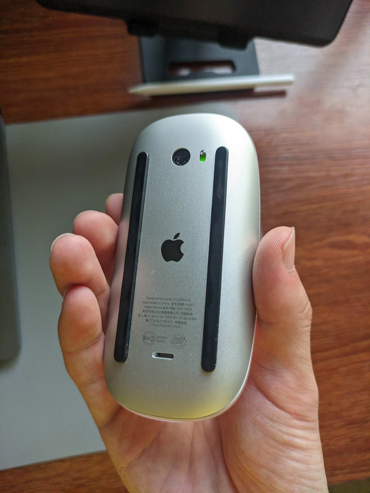

# 什麼是 Magic Mouse

蘋果設計的滑鼠。我英文非常好。所以說中文的時候，我一般叫它魔術滑鼠。

如果你不知道它長什麼樣，我可以給你幾張我的圖片。

# 關於 Magic Mouse 的爭議

我不知道你是一個什麼樣的人。我先假設你看過一些科技評測，比如 MKBHD。
我還得假設你是一個支持技術中立的人。

<HelperCard title="技術中立">

我說技術中立，是指支持所有技術擁有同等的機遇，
比如不因為媒體說核廢料怎麼樣而不支持核電廠。

</HelperCard>

## 爭議焦點

關於魔術滑鼠，最大的爭議點就是，蘋果是最有錢的科技公司。有錢意味著擁有最好的資源。他們可以僱用世界上最好的滑鼠設計師，造最好的滑鼠，偏偏他們沒有。魔術滑鼠不是一個好的滑鼠。特別是對於那些喜歡人體工學設計滑鼠的人來說。它手感很差，有些人會說，卡手的。

我在買這個滑鼠之前，也在網路上搜尋過一些關於它的評測，卻似乎沒有人說它不好。我不知道這是為什麼，或許蘋果付了一些錢。或許其他人不在乎，所以也不會做影片或者寫文章出來。

## 我怎麼看

我並不想寫一篇文章出來，說這個滑鼠爛透了、非常後悔買這個滑鼠。我也沒有興趣這麼做。事實上，我在買它之前就知道關於手感這方面的事情，還有這些爭議。我不在乎手感，我也不在乎其他人怎麼看而改變自己的想法。事實上，選擇這款滑鼠反而令我十分 _驕傲_ 。所以啊，這是我的觀點。

### Magic Mouse 不是一個好滑鼠

在上面的段落，我沒有在諷刺。我確實認為魔術滑鼠不是一個好滑鼠。
萬一你好奇為什麼：

- 它沒有辦法讓你可以休息手掌和手指；
- 它沒有實體按鍵來區分左右鍵；
- 它不能按中鍵；
- 它只能無線使用，延遲約 70ms；
- 它不能邊充電邊使用。此外，充電的時候，必須把滑鼠翻過來放。此外，介面是 Lightning。

我認為有些人會加上：

- 它沒有巨集和變速控制按鈕；
- 它沒有 RGB；
- 它沒有實體滾輪；
- 他沒有側邊按鍵。事實上，除了電源開關，它只有一個實體按鍵。

這些事情是客觀存在的。我不知道你怎麼看，但我相信大部分人不會考慮在自己的人生中用這樣的滑鼠三十秒，
更別提買一個日常使用了。但我不在乎其他人怎麼看。特別是很多人喜歡自己電腦有 RGB，
這讓我感覺他們把自己的電腦當作一個玩具。

### 只有蘋果會造這樣的滑鼠

我們來做一個思想實驗。想像蘋果不做滑鼠，今天羅技（Logitech）發布了魔術滑鼠，會發生什麼？

> 市場會決定它的去留。

因為羅技已經有成功的系列了，他們會砍掉魔術滑鼠，因為它賣得一點都不好。

但蘋果沒有其他的滑鼠產品線。蘋果也不靠賣滑鼠賺錢。他們做的事情，不過是做蘋果會做的事情。

當蘋果需要一個指標裝置（pointing device），考慮他們的風格：

- Magic Trackpad 沒有地方可以歇手。Vision Pro 沒有手柄。他們也不覺得手需要放在一個東西上，或者一直握著一個東西，所以可以用得舒服；
- 沒有操作需要滑鼠中鍵。他們甚至不喜歡滑鼠右鍵。預設情況下，Macintosh 透過 Control 鍵調出內容選單。
- Magic Keyboard 只能無線連接。他們認為有線連接是妥協的。在其他產品的設計上，例如 AirDrop、AirPlay、CarPlay、Universal Control，也有對無線連接的追求。
- 捲動操作應該是符合直覺的。滾輪本身是令人困惑的。螢幕上找不到一個要素，可以將滾輪的捲動與內容的捲動相對應。

### 我十分驕傲有這樣一個滑鼠

首先，我不是什麼果粉。我不喜歡蘋果的所有產品，比如 iPhone，也不能認同他們所有的理念，比如關於滑鼠右鍵的設計。我驕傲的點在於，我知道自己想要什麼，所以我可以判斷一個產品的價值，根據自身需求和設計哲學，而不受市場和輿論的誤導。

一方面，我覺得這是所有人都應該做的事情；另一方面，不是所有人，我認為甚至不是大多數人，知道自己想要什麼。

我不是說你也應該買一個魔術滑鼠。事實上，我不推薦大多數人買它。有時候，我還會在朋友面前調侃這個滑鼠。但這不影響我日常使用它。

# 「好」的相對性

我說魔術滑鼠不好，是指在大眾審美看來。事實上，市場也這麼覺得。魔術滑鼠的銷量是很差的。但不是所有人都這麼覺得。

<HelperCard title="審美">
  我說審美，不是說這個滑鼠長得不好看，我是說在選擇一個商品之前，批判的過程。
</HelperCard>

或許你會知道，我之前有做一些科技產品的評測影片，雖然是幾年前的事情了。我那時候還沒能明白這些道理，所以現在的我不能支持我那時候所有的觀點。此外，明白了這些道理，我覺得做評測很沒意思。

  一方面，每個人的需求不同。另一方面，我買的很多不是大眾化的東西。我不是說只有大眾化的東西可以評測，但確實比較少價值了。

故事的寓意就是，很多時候不需要在乎其他人覺得好不好，就算他們是過來人（比如實測產品，然後做成評測的人）。我不是說評測不能看，而是看的時候，應該關注這個東西到底是什麼。當然，前提是你知道自己想要什麼。
