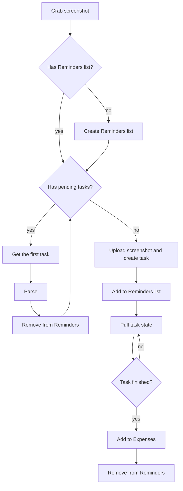

import { getRelativeArticleUrl } from "../../utils/article-url.ts";

To keep track of my realtime expenses, I had came up with <a
href={getRelativeArticleUrl("share-a-bookkeeping-shortcut", "en")}>an Apple
shortcut</a> several weeks ago. So turns out the original design is defective
and has limitations I would not like to accept:

1. The phone heated and became less responsive while running it. It was very
   hot, and my fingers kinda hurt when touching it
2. Screenshots of more complicated interfaces would take the VLM more time to
   describe, sometimes timingout the workflow in which case I had to try again
   and pray to god
3. The workflow cannot be paused, meaning no putting the phone into sleep, which
   is very unintuitive
4. <a href="https://x.com/zhufucdev/status/2026925088965275961">
     An recent update broke Locally AI VLM shortcut support
   </a>
   , so the workflow does not work anyway

## Custom LLM inference runtime

Giving the situation some thought, I figured it would make sense to migrate away
from Locally AI all together, offloading the heavy inference work to my NAS,
which has a NVIDIA GTX 1080 Ti with 11 GiB VRAM in it. It is old, but after some
experiments, turned out that llama.cpp worked perfectly fine with CUDA of
compute capability 61. But this limits model selection. The lack of FP16 support
caused out-of-memory issues and higher latency. I chose to do things
conservatively, and finally landed on this comb:

- `Qwen3-VL-4B-Instruct-GGUF` for describing screenshot
- `gemma-3-1b-it-qat-q4_0-gguf` for extracting structured data

I prefer a more integrated solution, a single binary which works out of the box.
It brings more control to the LM compared to API calling, and using a custom
sampling pipeline, I was able to achieve both high accuracy and reasonable
latency.

The custom sampling uses techniques called guided generation and prefilling. I
came up with simple Lark grammars, and used the llguidance sampler to constraint
the output format. Some extend to my surprise though, in practice this is not
enough, presumably llama.cpp striped out some low possibility tokens or the
chosen Rust binding was bugged. Feared to admit, I failed to figure out the
exact reason, not to mention solving it, and that's the perfect time for me to
seek a workaround. After some trial and error, I noticed that desired formats
starts with keyword like "Summary" or "Category", and I just appended them to
the respective context window before the LLM starts to generate. This yielded
stable outputs, and could be parsed programmatically with confidence.

One run takes from 50 to 70 seconds, and half of the available VRAM. I am happy
on that. The GPU didn't cost me much anyway~ Either way, here's a nvtop
screenshot during execution of the workflow, FYI:


No worries about root execution, the app's running in a container. I published
the image to docker hub, and ran it as so:

```shell
docker run --mount type=bind,source=/var/lib/hf-hub,destination=/huggingface \
	--device nvidia.com/gpu=all \
	-p 3101:3100 -it \
	--env HF_TOKEN="hf_crAzyFrIDaYvIvo50" \
	--env HF_ENDPOINT=https://hf-mirror.com
	zhufucdev/ledoxide:latest
```

You can get a more detailed doc here:

<Repo id="zhufucdev/ledoxide" provider="github" />

## Shortcuts design

The app cannot send results to the bookkeeping app directly, and I have to rely
on shortcuts to grap screenshots anyway. I redsigned the workflow centered
around client side pulling and pending task persistency, as is shown in the
following diagram.



The shortcut keeps track of unfinished tasks using Apple Reminders, so that both
the program and I can understand what's going on.


In case the shortcut execution was interrupted so even though the server task
has finished, result would never reach me and my books. I often forget to check
the list. So before each run, the shortcut scans the list and prompts me of any
update, so that it won't straight up go ignored. In practice, putting the phone
into sleep often cause the pulling loop to an end, and this little mechansim can
always come in handy.

I broken the workflow into several shortcuts for reusability and ease of
implementation. The downside is that it's really a hassle to share and install
them for friends. With that said, if you wanna give it a try, I have you
covered.


- Resume Pending Bills:
  https://www.icloud.com/shortcuts/f213c1a044fc46feaf047e775c57e505
- Parse Bill: https://www.icloud.com/shortcuts/554c2982c79749a09b102c92fddd19ee
- Get Pending Bills List Or Create:
  https://www.icloud.com/shortcuts/0006809635ec4fe39f76a2d86e655168
- Record Bill: https://www.icloud.com/shortcuts/9754ca32a62043da8180cd9d48259a0f
- Action Button:
  https://www.icloud.com/shortcuts/bddb8a490f2844e393cb1c199f54192a

You shall have own server running, and answer the setup questions respectively.
I am also happy to lend me my server, if we are good friends.
