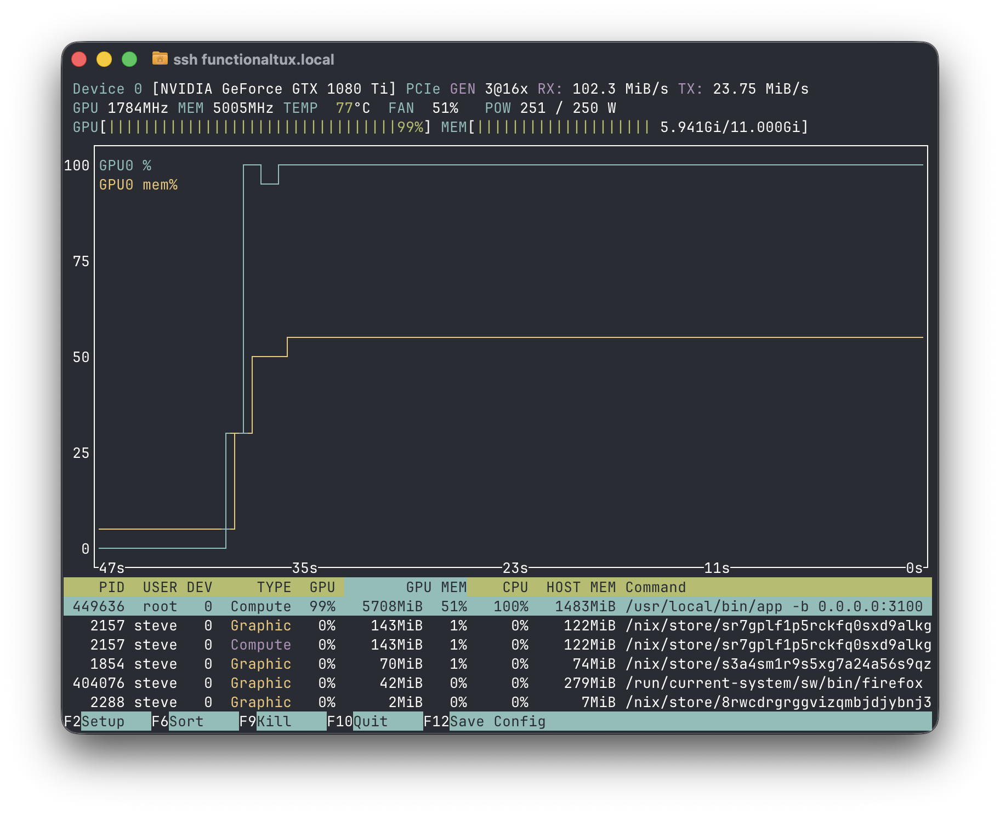
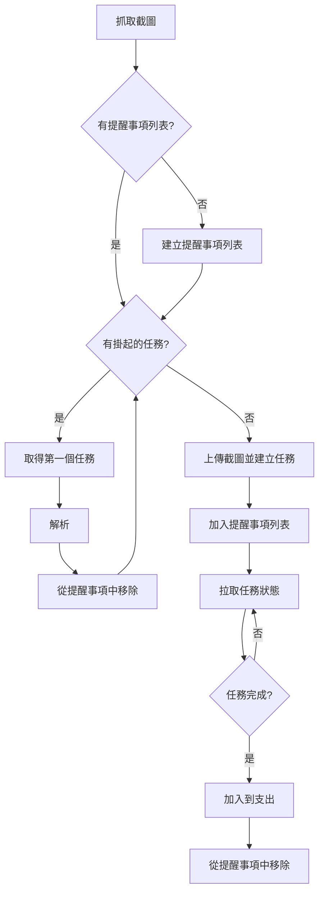
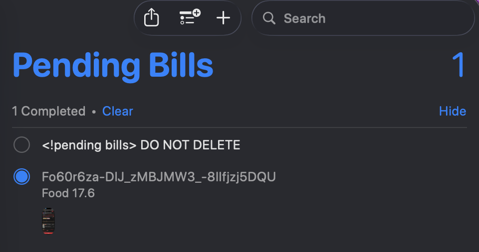
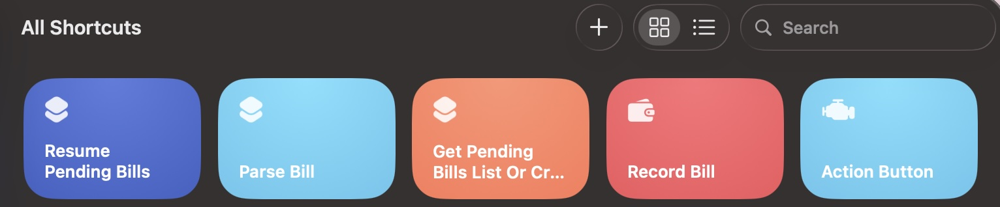

import { getRelativeArticleUrl } from "../../utils/article-url.ts";

為了及時追蹤我的日常開銷，我在幾週前寫了<a
href={getRelativeArticleUrl("share-a-bookkeeping-shortcut",
"zh-tw")}>一個蘋果捷徑</a>。但結果證明，最初的設計存在缺陷，並且有一些我無法接受的限制：

1. 手機在運行它時會發熱並且變得卡頓。它非常燙，手指碰到上面感覺有點痛
2. 對於更複雜的介面截圖，VLM需要更多時間來描述，有時會導致工作流程超時，這種情況下我只能重試並祈禱能成功
3. 工作流程無法暫停，這意味著不能讓手機休眠，這非常反直覺
4. <a href="https://x.com/zhufucdev/status/2026925088965275961">
     最近的一次更新破壞了 Locally AI 對 VLM 捷徑的支援
   </a>
   ，因此這個工作流程無論如何都無法使用了

## 自訂 LLM 推理執行時

經過一番思考，我認為徹底放棄Locally
AI並將繁重的推理工作轉移到我的NAS上是合理的。我的NAS裡有一張11
GiB顯示記憶體的NVIDIA GTX 1080
Ti。雖然它很老了，但經過一些測試，我發現llama.cpp在CUDA
CAP為61的顯示卡上運行得非常好。但這限制了模型的選擇。缺乏FP16支援會導致記憶體不足問題和更高的延遲。我選擇了保守的做法，最終確定了這個組合：

- `Qwen3-VL-4B-Instruct-GGUF` 用於描述截圖
- `gemma-3-1b-it-qat-q4_0-gguf` 用於提取結構化資料

我更喜歡一個更整合的解決方案，即開箱即用的單一可執行檔。與呼叫API相比，它能帶來對模型更多的控制權。透過使用自訂的採樣管道，我實現了高準確率和合理的延遲。

自訂採樣使用了引導生成 (guided
generation) 和預填充 (prefilling) 技巧。我編寫了簡單的Lark語法，並使用llguidance採樣器來約束輸出格式。但令我驚訝的是，在實踐中這還不夠，大概是llama.cpp剔除了一些低機率的token，或者是所選的Rust綁定有bug。不得不承認，我未能找出確切原因，更不用說解決它了，所以這也是我尋找變通方法的絕佳時機。經過反覆試驗，我注意到期望的格式往往以「Summary」或「Category」等關鍵字開頭，因此我只需在LLM開始生成之前將它們追加到各自的上下文視窗中。這產生了穩定的輸出，並且可以自信地進行程式化解析。

一次運行需要50到70秒，並且會佔用一半的可用顯示記憶體。對此我很滿意，反正這張顯示卡並不貴~ 無論如何，這裡有一張工作流程執行期間的nvtop截圖，供你參考：



不用擔心root執行權限的問題，這個應用是在容器裡運行的。我把映像檔發布到了docker
hub，並像這樣運行它：

```shell
docker run --mount type=bind,source=/var/lib/hf-hub,destination=/huggingface \
	--device nvidia.com/gpu=all \
	-p 3101:3100 -it \
	--env HF_TOKEN="hf_crAzyFrIDaYvIvo50" \
	--env HF_ENDPOINT=https://hf-mirror.com
	zhufucdev/ledoxide:latest
```

你可以在這裡取得更詳細的文件：

<Repo id="zhufucdev/ledoxide" provider="github" />

## 捷徑設計

該應用無法直接將結果發送給記帳軟體，而且我無論如何都必須依賴捷徑來抓取截圖。我重新設計了工作流程，以客戶端輪詢和掛起任務持久化為中心，如下圖所示。



這個捷徑使用蘋果的「提醒事項」來追蹤未完成的任務，這樣程式和我都清楚目前的進展。



如果捷徑執行被中斷，那麼即使伺服器任務已經完成，結果也永遠無法到達我和我的帳本。我經常忘記檢查這個列表。因此，在每次運行之前，捷徑會掃描該列表並提示我任何更新，這樣它就不會被直接忽略了。在實踐中，讓手機休眠經常會導致輪詢迴圈終止，而這個小機制總能派上用場。

為了可重複使用性和易於實作，我將工作流程拆分為多個捷徑。缺點是，與朋友分享和安裝它們確實很麻煩。話雖如此，如果你想試一試，我已經為你準備好了。



- 恢復掛起帳單 (Resume Pending Bills):
  https://www.icloud.com/shortcuts/f213c1a044fc46feaf047e775c57e505
- 解析帳單 (Parse Bill):
  https://www.icloud.com/shortcuts/554c2982c79749a09b102c92fddd19ee
- 取得掛起帳單列表或建立 (Get Pending Bills List Or Create):
  https://www.icloud.com/shortcuts/0006809635ec4fe39f76a2d86e655168
- 記錄帳單 (Record Bill):
  https://www.icloud.com/shortcuts/9754ca32a62043da8180cd9d48259a0f
- 動作按鈕 (Action Button):
  https://www.icloud.com/shortcuts/bddb8a490f2844e393cb1c199f54192a

你需要運行自己的伺服器，並回答相應的設定問題。如果我們是好朋友，我也很樂意把我的伺服器借給你用。
