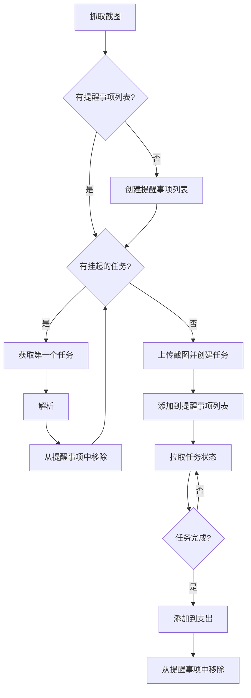

import { getRelativeArticleUrl } from "../../utils/article-url.ts";

为了及时追踪我的日常开销，我在几周前写了<a
href={getRelativeArticleUrl("share-a-bookkeeping-shortcut",
"zh")}>一个苹果快捷指令</a>。但结果证明，最初的设计存在缺陷，并且有一些我无法接受的限制：

1. 手机在运行它时会发热并且变得卡顿。它非常烫，手指碰到上面感觉有点痛
2. 对于更复杂的界面截图，VLM需要更多时间来描述，有时会导致工作流超时，这种情况下我只能重试并祈祷能成功
3. 工作流无法暂停，这意味着不能让手机息屏，这非常反直觉
4. <a href="https://x.com/zhufucdev/status/2026925088965275961">
     最近的一次更新破坏了 Locally AI 对 VLM 快捷指令的支持
   </a>
   ，因此这个工作流无论如何都无法使用了

## 自定义 LLM 推理运行时

经过一番思考，我认为彻底放弃Locally
AI并将繁重的推理工作转移到我的NAS上是合理的。我的NAS里有一张11 GiB显存的NVIDIA
GTX 1080 Ti。虽然它很老了，但经过一些测试，我发现llama.cpp在CUDA
CAP为61的显卡上运行得非常好。但这限制了模型的选择。缺乏FP16支持会导致内存不足问题和更高的延迟。我选择了保守的做法，最终确定了这个组合：

- `Qwen3-VL-4B-Instruct-GGUF` 用于描述截图
- `gemma-3-1b-it-qat-q4_0-gguf` 用于提取结构化数据

我更喜欢一个更集成的解决方案，即开箱即用的单一可执行文件。与调用API相比，它能带来对模型更多的控制权。通过使用自定义的采样管道，我实现了高准确率和合理的延迟。

自定义采样使用了引导生成 (guided
generation) 和预填充 (prefilling) 技巧。我编写了简单的Lark语法，并使用llguidance采样器来约束输出格式。但令我惊讶的是，在实践中这还不够，大概是llama.cpp剔除了一些低概率的token，或者是所选的Rust绑定有bug。不得不承认，我未能找出确切原因，更不用说解决它了，所以这也是我寻找变通方法的绝佳时机。经过反复试验，我注意到期望的格式往往以“Summary”或“Category”等关键字开头，因此我只需在LLM开始生成之前将它们追加到各自的上下文窗口中。这产生了稳定的输出，并且可以自信地进行程序化解析。

一次运行需要50到70秒，并且会占用一半的可用显存。对此我很满意，反正这张显卡并不贵~ 无论如何，这里有一张工作流执行期间的nvtop截图，供你参考：


不用担心root执行权限的问题，这个应用是在容器里运行的。我把镜像发布到了docker
hub，并像这样运行它：

```shell
docker run --mount type=bind,source=/var/lib/hf-hub,destination=/huggingface \
	--device nvidia.com/gpu=all \
	-p 3101:3100 -it \
	--env HF_TOKEN="hf_crAzyFrIDaYvIvo50" \
	--env HF_ENDPOINT=https://hf-mirror.com
	zhufucdev/ledoxide:latest
```

你可以在这里获取更详细的文档：

<Repo id="zhufucdev/ledoxide" provider="github" />

## 快捷指令设计

该应用无法直接将结果发送给记账软件，而且我无论如何都必须依赖快捷指令来抓取截图。我重新设计了工作流，以客户端轮询和挂起任务持久化为中心，如下图所示。



这个快捷指令使用苹果的“提醒事项”来跟踪未完成的任务，这样程序和我都清楚目前的进展。


如果快捷指令执行被中断，那么即使服务器任务已经完成，结果也永远无法到达我和我的账本。我经常忘记检查这个列表。因此，在每次运行之前，快捷指令会扫描该列表并提示我任何更新，这样它就不会被直接忽略了。在实践中，让手机息屏经常会导致轮询循环终止，而这个小机制总能派上用场。

为了可复用性和易于实现，我将工作流拆分为多个快捷指令。缺点是，与朋友分享和安装它们确实很麻烦。话虽如此，如果你想试一试，我已经为你准备好了。


- 恢复挂起账单 (Resume Pending Bills):
  https://www.icloud.com/shortcuts/f213c1a044fc46feaf047e775c57e505
- 解析账单 (Parse Bill):
  https://www.icloud.com/shortcuts/554c2982c79749a09b102c92fddd19ee
- 获取挂起账单列表或创建 (Get Pending Bills List Or Create):
  https://www.icloud.com/shortcuts/0006809635ec4fe39f76a2d86e655168
- 记录账单 (Record Bill):
  https://www.icloud.com/shortcuts/9754ca32a62043da8180cd9d48259a0f
- 操作按钮 (Action Button):
  https://www.icloud.com/shortcuts/bddb8a490f2844e393cb1c199f54192a

你需要运行自己的服务器，并回答相应的设置问题。如果我们是好朋友，我也很乐意把我的服务器借给你用。
