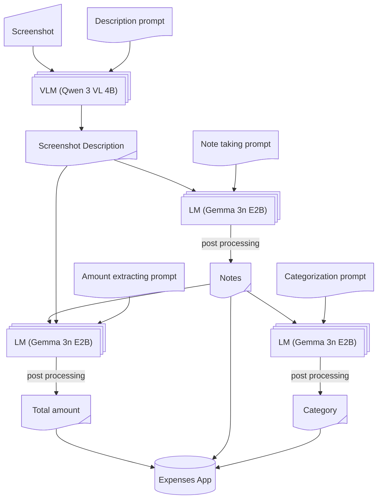

It stroke me that I've been spending too much, which probably doesn't fit well
in my current finances. To plausibly avoid the unwanted worst-case senario, I
built a bookkeeping workflow with simple technologies available at hand:

- Apple Shortcuts
- [Locally AI](https://locallyai.app)
- [Expenses](https://expenses.cash)

And turns out, it's pretty good. I enjoyed using it, mostly out of curiosity on
what the LLMs would spit out this time, but hey ho. The accuracy is pretty high,
while keeping an reasonable waiting time. Computation is fully local, so pravicy
is secured, at least more so compared to any other solution I am aware of.

In any case, if you wanted the shortcut, I am more than glad to share it with
you:

https://www.icloud.com/shortcuts/c31930fac7d948768ed8464b60500e6e

You may use the shortcut however you like it. Share it with other people. Tailor
to your own workflow. At this point, there's techiquely nothing more to say, but
I feel like yapping. So continue reading if you want to.

## The Workflow in Detail

To be honest, I did not realize how much complication had been introduced until
laying out the ins-and-outs. Don't worry though, I got you covered.



Let's break it down:

- End goal: to feed information that Expenses app requires
  - amount
  - category
  - notes (which is not mandatory, but I like the idea, and it makes the prompt
    more stable)

The concrete implementation tend to vary, depending on what bookkeeping app you
are using. You would like to alter a bit if your situations are different.


### Prompts

For each task, I wrote a tiny prompt for the LLM to follow. Prompts, if you are
not familiar, are instructions guiding the intelligence. Here is the one for the
vision language model (VLM) to get a stable outcome of image description.

```text
Describe this image faithfully. If there are numbers, include EACH of them in your descrpition. Your response should follow the template. Do not include the template XML tags
<template>
- In the top bar, there is [header text], indicating this image is a screenshot of [a page], telling the user an incoming purchase of [thing] / an already completed bill of [thing]
- For main content, there are several items, including [main content]
- For bottom section, there is [bottom content], indicating [possible actions and/or results]
- The bill is originally [original price: number](, and is discounted by [discount: number]) bringing the final amount to [final amount: number]
</template>
```

Here we also have one for note taking, extracting dense information from the
long image description, which is wrapped in an XML tag. This I believe is a
common and effective prompt engineering technique.

```text
Summarize text to provide an distinct identity of the purchase, such as name, type and retailer of of the goods. Your summary should be no more than 10 words
<text>
Image description
</text>
```

The other ones (for amount extraction and categorization) is pretty
straightforward, so omitted they are~

I think my prompt is pretty well written, given the tinkering pokering I have
come through and the outcome I have gotten, which was tested in several apps,
including

- JD
- Taobao (Alibaba)
- Manner Coffee
- Emails
- Even for real life receipts!

It was quite some suffering though, luckily didn't and will not cost me a cent,
hehe. As far as I know, larger models tend to require less micromanaging as
such, definitely not small enough to be deployed on a mobile phone, and can be
expensive. I got the basic idea designing for them, mind you, and let me tell
ya, the architecture would be from another world. For now, I have settled in
this old-school way instead of keeping up with the latest trends.

### Models

Have tried several models, range in parameter size and architecure. Here's a
currated list, in case you are curious:

- LFM 2.5 VL (1.6B): too dumb, could not follow instructions sometimes
- LFM 2.5 Thinking (1.2B): pretty smart, but often timeouted (only Apple can do)
- Ministral 3 (3B): too dumb, straight up making thing up
- Gemini 3 QAT (4B): vision model, too slow, quality was fine
- LLaMa 3.2 (1B): hallucinated
- Qwen 3 VL (4B): good quality, followed instructions
- Gemma 3n (E2B): same

So the last two were my final choices. They both require much resources to run
on, 3~4 GiB RAM according to my Mac. This should be fine for iPhones from the
last 2 years I think.

I suppose Qwen 3 VL can handle all the tasks, but it's like 3.11 GiB in size,
and I don't want to burn too much battery, so for text summarization I used a
smaller Gemma model instead, which is 2.51 GiB. But still, when switching models
the system will suffer from cache miss, so is it net positive? Hard to say...
Only if Apple could add a toggle to turn off the 30-second time limit could I
freely use CoT models.

Also, shout out to Locally AI team, they did a excellent job. Very accessible
app, without which it would take much longer to experiment with different
models. O7

## General Design Experience & The System

The Apple Shortcuts and AppIntent framework is really powerful, I had to admit.
Don't think there are Android equivalents. The cloests one I know is from
Samsung, but not as integrated and does not support freely passing data between
very different thirdparty apps. Still not a fan of close-sourceness, but for now
this is the most practical solution. Also, the proprietary system softwares by
most Android manufacturers are as bad as Apple if no better, so you know.

Also early 2026 witnessed AI systems of full automa (OpenClaw). With models of
much more raw power intelligence can really emerge given full system access, but
still I respect my privacy and encourage you to do the same. The day when simple
prompts can get all things done is plausible, though if the models are
practically controlled by evil big corporations, I dunno... Not happy about
that.
