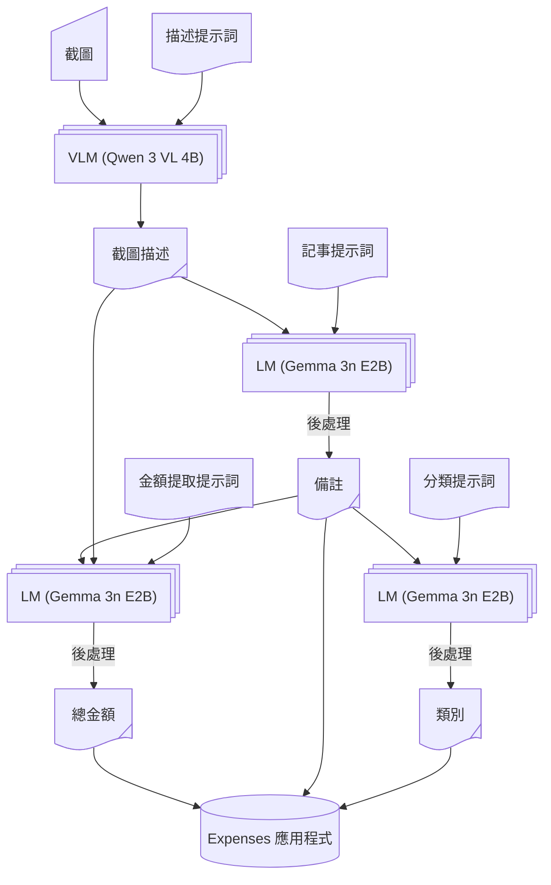

我突然意識到我花錢太多了，這可能不太符合我目前的財務狀況。為了盡可能避免最壞的情況發生，我利用手頭簡單的技術構建了一個記帳工作流程：

- Apple 捷徑（免費，但你知道它的槽點）
- [Locally AI](https://locallyai.app)（免費，閉源）
- [Expenses](https://expenses.cash)（有限制地免費，閉源）

事實證明，效果相當不錯。我很享受使用它的過程，雖然多半是出於對 LLM 這次又會吐出什麼東西的好奇，但嘿，它的準確率非常高，同時能有合理的等待時間。計算完全在本地完成，因此隱私得到了保障，至少比我所知道的其他方案都更安全。

不管怎麼說，要是你想要這個捷徑，我很樂意分享給你：

https://www.icloud.com/shortcuts/c31930fac7d948768ed8464b60500e6e

你可以隨心所欲地使用它。分享給他人。根據你自己的工作流程進行調整。技術上來說，到這裡已經沒什麼可說的了，但我還想多嘮叨幾句。所以如果你願意的話，請繼續閱讀。

## 工作流程細節

說實話，直到梳理出其中的來龍去脈，我才意識到引入了多少複雜性。不過別擔心，我已經幫你理清楚了。



讓我們分解一下：

- 最終目標：向 Expenses 應用程式提供所需的資訊
  - 金額
  - 類別
  - 備註（這不是必須，但我喜歡，而且它能讓提示詞更穩定）

具體的實現往往會有所不同，這取決於你使用的記帳應用程式。如果你的情況不同，你可能需要稍微修改一下。


### 提示詞

對於每個任務，我都寫了一個簡短的提示詞讓 LLM 遵循。如果你不熟悉，提示詞就是引導智慧的指令。以下是視覺語言模型 (VLM) 用來獲取穩定圖像描述結果的提示詞。

```text
Describe this image faithfully. If there are numbers, include EACH of them in your descrpition. Your response should follow the template. Do not include the template XML tags
<template>
- In the top bar, there is [header text], indicating this image is a screenshot of [a page], telling the user an incoming purchase of [thing] / an already completed bill of [thing]
- For main content, there are several items, including [main content]
- For bottom section, there is [bottom content], indicating [possible actions and/or results]
- The bill is originally [original price: number](, and is discounted by [discount: number]) bringing the final amount to [final amount: number]
</template>
```

這裡我們還有一個用於記事的提示詞，從長長的圖像描述中提取密集資訊，該描述被包裹在 XML 標籤中。這應該是一種常見且有效的提示詞工程技術。

```text
Summarize text to provide an distinct identity of the purchase, such as name, type and retailer of of the goods. Your summary should be no more than 10 words
<text>
Image description
</text>
```

其他的（金額提取和類別劃分）非常直截了當，所以就省略啦~

考慮到我經歷的那些折騰和得到的結果，我認為我的提示詞寫得相當不錯。我在幾個應用程式中進行了測試，包括：

- 京東
- 淘寶
- Manner Coffee
- 電子郵件
- 甚至是現實生活中的收據！

雖然過程相當痛苦，但幸運的是，一分錢也沒花，嘻嘻。另外據我所知，更大的模型往往不需要如此細緻的微操，但它們肯定不夠小，無法部署在手機上，而且可能很貴。先提前說好，要對那種模型的做設計，我也略知一二，而且設計出來架構可以說是截然不同。目前，我選擇了這種「老派」的方式，而不是追求最新的趨勢（指的是智慧體、循環、MCP 等）。

### 模型

我嘗試了幾個模型，參數規模和架構各異。如果你好奇的話，這裡有一份精選清單：

- LFM 2.5 VL (1.6B)：太笨了，有時無法遵循指令
- LFM 2.5 Thinking (1.2B)：相當聰明，但經常逾時（only Apple can do）
- Ministral 3 (3B)：太笨了，直接開始胡編亂造
- Gemini 3 QAT (4B)：視覺模型，太慢了，品質還可以
- LLaMa 3.2 (1B)：產生幻覺
- Qwen 3 VL (4B)：品質好，遵循指令
- Gemma 3n (E2B)：同上

所以最後兩個是我的最終選擇。它們執行起來都需要大量資源，根據我的 Mac 顯示，需要 3~4
GiB 的 RAM。我認為過去兩年的 iPhone 應該沒問題。

我猜 Qwen 3 VL 可以處理所有任務，但它的大小約為 3.11
GiB，我不想消耗太多電量，所以對於文本總結，我改用了較小的 Gemma 模型，大小為 2.51
GiB。但是，切換模型時系統會無法命中快取，所以這真的是正向收益嗎？很難說……除非蘋果能增加一個開關來關閉 30 秒的時間限制，我才能自由地使用 CoT 模型。

另外，也要大讚 Locally
AI 團隊，他們做得非常棒。非常易用的應用程式，如果沒有它，嘗試不同模型將花費更長的時間。向你們致敬。O7

## 總體設計體驗與系統觀點

我必須承認，Apple 捷徑和 AppIntent 框架確實非常強大。我不認為 Android 上有同等的產品，所知道的最接近的是三星，但整合度沒那麼高，不支援在多種第三方應用程式之間自由傳遞數據。雖然我仍然不喜歡閉源，但目前這是最實用的方案。而且，大多數 Android 廠商的專有系統軟體即使不比蘋果糟糕，也好不到哪去，所以你懂的。

此外，2026 年初見證了全自動 AI 系統（OpenClaw）的興起。擁有更強大原始能力的模型在獲得完整系統存取權限後，確實可以產生智慧，但我仍然尊重我的隱私，並鼓勵你也這樣做。雖然用簡單的提示詞就能搞定所有事情的那一天似乎近在咫尺，但如果這些模型實際上被邪惡的大公司控制著，很難辦了……我不喜歡那樣。
