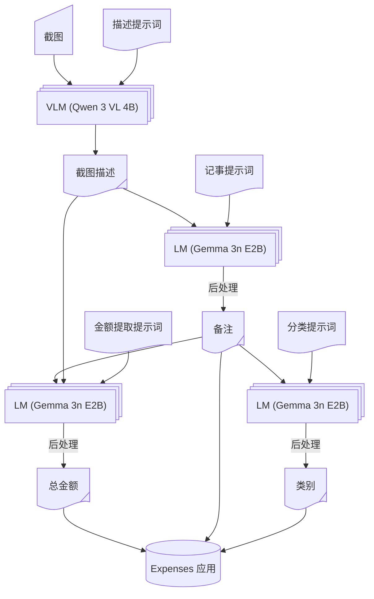
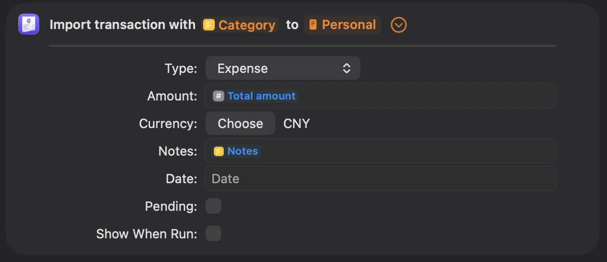

我突然意识到我花钱太多了，这可能不太符合我目前的财务状况。为了尽可能避免最坏的情况发生，我利用手头简单的技术构建了一个记账工作流：

- Apple 快捷指令（免费，但你知道它的槽点）
- [Locally AI](https://locallyai.app)（免费，闭源）
- [Expenses](https://expenses.cash)（有限制地免费，闭源）

事实证明，效果相当不错。我很享受使用它的过程，虽然多半是出于对 LLM 这次又会吐出什么东西的好奇，但嘿，它的准确率非常高，同时能有合理的等待时间。计算完全在本地完成，因此隐私得到了保障，至少比我所知道的其他方案都更安全。

不管怎么说，要是你想要这个快捷指令，我很乐意分享给你：

https://www.icloud.com/shortcuts/c31930fac7d948768ed8464b60500e6e

你可以随心所欲地使用它。分享给他人。根据你自己的工作流进行调整。技术上来说，到这里已经没什么可说的了，但我还想多唠叨几句。所以如果你愿意的话，请继续阅读。

## 工作流细节

说实话，直到梳理出其中的来龙去脉，我才意识到引入了多少复杂性。不过别担心，我已经帮你理清楚了。



让我们分解一下：

- 最终目标：向 Expenses 应用提供所需的信息
  - 金额
  - 类别
  - 备注（这不是必须，但我喜欢，而且它能让提示词更稳定）

具体的实现往往会有所不同，这取决于你使用的记账应用。如果你的情况不同，你可能需要稍微修改一下。


### 提示词

对于每个任务，我都写了一个简短的提示词让LLM遵循。如果你不熟悉，提示词就是引导智能的指令。以下是视觉语言模型 (VLM) 用来获取稳定图像描述结果的提示词。

```text
Describe this image faithfully. If there are numbers, include EACH of them in your descrpition. Your response should follow the template. Do not include the template XML tags
<template>
- In the top bar, there is [header text], indicating this image is a screenshot of [a page], telling the user an incoming purchase of [thing] / an already completed bill of [thing]
- For main content, there are several items, including [main content]
- For bottom section, there is [bottom content], indicating [possible actions and/or results]
- The bill is originally [original price: number](, and is discounted by [discount: number]) bringing the final amount to [final amount: number]
</template>
```

这里我们还有一个用于记事的提示词，从长长的图像描述中提取密集信息，该描述被包裹在 XML 标签中。这应该是一种常见且有效的提示词工程技术。

```text
Summarize text to provide an distinct identity of the purchase, such as name, type and retailer of of the goods. Your summary should be no more than 10 words
<text>
Image description
</text>
```

其他的（金额提取和类别划分）非常直截了当，所以就省略啦~

考虑到我经历的那些折腾和得到的结果，我认为我的提示词写得相当不错。我在几个应用中进行了测试，包括：

- 京东
- 淘宝
- Manner Coffee
- 电子邮件
- 甚至是现实生活中的收据！

虽然过程相当痛苦，但幸运的是，一分钱也没花，嘻嘻。另外据我所知，更大的模型往往不需要如此细致的微操，但它们肯定不够小，无法部署在手机上，而且可能很贵。先提前说好，要对那种模型的做设计，我也略知一二，而且设计出来架构可以说是截然不同。目前，我选择了这种“老派”的方式，而不是追求最新的趋势（指的是智能体、循环、MCP等）。

### 模型

我尝试了几个模型，参数规模和架构各异。如果你好奇的话，这里有一份精选清单：

- LFM 2.5 VL (1.6B)：太笨了，有时无法遵循指令
- LFM 2.5 Thinking (1.2B)：相当聪明，但经常超时（only Apple can do）
- Ministral 3 (3B)：太笨了，直接开始胡编乱造
- Gemini 3 QAT (4B)：视觉模型，太慢了，质量还可以
- LLaMa 3.2 (1B)：产生幻觉
- Qwen 3 VL (4B)：质量好，遵循指令
- Gemma 3n (E2B)：同上

所以最后两个是我的最终选择。它们运行起来都需要大量资源，根据我的Mac显示，需要3~4
GiB的RAM。我认为过去两年的iPhone应该没问题。

我猜Qwen 3 VL可以处理所有任务，但它的大小约为3.11
GiB，我不想消耗太多电量，所以对于文本总结，我改用了较小的Gemma模型，大小为 2.51
GiB。但是，切换模型时系统会无法命中缓存，所以这真的是正向收益吗？很难说……除非苹果能增加一个开关来关闭30秒的时间限制，我才能自由地使用CoT模型。

另外，也要大赞Locally
AI团队，他们做得非常棒。非常易用的应用，如果没有它，尝试不同模型将花费更长的时间。向你们致敬。O7

## 总体设计体验与系统观点

我必须承认，Apple 快捷指令和 AppIntent 框架确实非常强大。我不认为安卓上有同等的产品，所知道的最接近的是三星，但集成度没那么高，不支持在多种第三方应用之间自由传递数据。虽然我仍然不喜欢闭源，但目前这是最实用的方案。而且，大多数安卓厂商的专有系统软件即使不比苹果糟糕，也好不到哪去，所以你懂的。

此外，2026年初见证了全自动AI系统（OpenClaw）的兴起。拥有更强大原始能力的模型在获得完整系统访问权限后，确实可以产生智能，但我仍然尊重我的隐私，并鼓励你也这样做。虽然用简单的提示词就能搞定所有事情的那一天似乎近在咫尺，但如果这些模型实际上被邪恶的大公司控制着，很难办了……我不喜欢那样。
