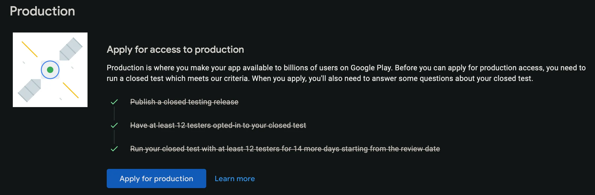
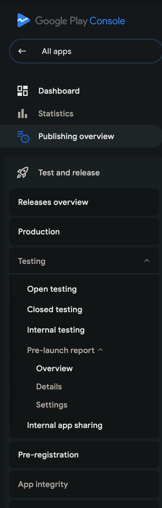

我的旗艦應用程式（Practiso）計劃上架 Play Store。從開始至今，三個月過去了，這一計劃沒有明顯的進展。公平來說，我花在開發的時間比營運的多得多，但後者，也就是我今天要談論的 Google Play，顯然需要比我預先設想的多太多的時間。

### 問題 1：封閉測試

根據 [Google 的說明文件](https://support.google.com/googleplay/android-developer/answer/14151465)，**個人**開發者帳號被要求：

1. 建立封閉測試計畫，上傳 AAB
2. 邀請 12 人加入該測試計畫
3. 測試 14 天

完成這些之後就可以發佈了吧？或許是的，我這麼想。我邀請了 12 個人，這沒問題，兩天內完成。測試 14 天？這具體如何執行，我也不知道。我的做法是什麼都不做，靜置 14 天後，Play 控制台顯示任務都已完成。

我超期待的點了申請按鈕，被問到了這些問題：

> Describe the engagement you received from testers during your closed test: include whether or not testers utilized all of the features in your app, and whether tester usage was consistent with how you would expect a real user to use your app. If not, describe the differences you would expect to see.

Tester engagement？那自然是沒有的。我只能讓 ChatGPT 假裝測試者回答這個問題。還有 4 個相關的問題，我概括一下：

- 問題 2：測試回饋的摘要？
- 問題 3：應用程式準備好上架了嗎？有多準備好？
- 問題 4：你怎麼知道它準備好了？

這些問題真他媽垃圾。我用 AI 填寫了，等了四五天，結果自然是被拒絕的，他們的理由是：

- Testers were not engaged with your app during your closed test
- You didn't follow testing best practices, which may include gathering and acting on user feedback through updates to your app

這到底是什麼鬼意思，怎麼才能讓測試者更加參與？下載次數更多？我是想不透。什麼叫沒有遵循最佳實踐？我哪裡知道呀？

### 問題 2：控制台互動邏輯

Play Console 的使用十分令人困惑。側邊導覽列裡面有個深度為 4 的樹。

更新應用程式頁面可以選擇包含舊版本的資源檔案，同時可以上傳新版本，這就有三種結果：

1. 選擇發佈舊版本 -> 這個更新包含空內容
2. 選擇發佈新版本和舊版本 -> 這個更新的內容完全被舊版本的資源檔案所替換
3. 選擇發佈新版本 -> 通過

Google 真的想做一個全能面板。
修改都可以存成草稿。恢復原始狀態的時間不如刪除重做。開發者真的需要知道自己在做什麼。

### 我會繼續努力

還存在其他問題，但我不想太龜毛。至少我認識到需要花更多時間在這上面。另外，或許讀者你可以幫我測試？或許得付錢找一個什麼團隊完成這次上架了。如果你有興趣，點擊下面這個連結，幫我一把。

Android：https://play.google.com/store/apps/details?id=com.zhufucdev.practiso

Web：https://play.google.com/apps/testing/com.zhufucdev.practiso
