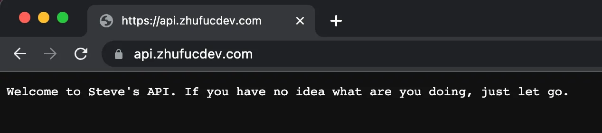

<HelperCard variant="warn" title="This is not a tutorial">
  I have no credential in Edge development, and sometimes I don't know what I am
  doing. But this is what the Internet is all about.
</HelperCard>

# Background

It's among the things I got to know recently for edge computing. ~To be honest,
nobody is responsible for the suffering from web technology~

Edge computing is created to run code in CDN, and it comes with the following
advantages

- Very fast, low delay
- Service as a Platform, so that no pain in managing VPS
- Charged on demand

It's pretty cool I assume, but never got the chance. To do something, I get to
give it a shot recently

# The Plan

I am working on some unified interface, in case my app wants to check for self
update, which many people simply direct to the GitHub API, and in my case it is
not so elegant to do so

Vercel supplies some
[Edge Functions](https://vercel.com/docs/concepts/functions/edge-functions),
where the 500, 000 free requests usage is quit enough

# Trying

First of all, the Vercel runtime is implemented in V8, so we've got to prepare
some JavaScript

```shell
mkdir api.zhufucdev && cd api.zhufucdev
npm install octokit query-string
```

The `query-string` is a random pick

According to the
[documentations](https://vercel.com/docs/concepts/functions/edge-functions/quickstart)
by Vercel:

> First, create a new project and add an /api directory and a hello.ts file
> inside it. This is where the code that will be deployed as an Edge Function
> will live. The file extension can be .ts or .js. Alternatively, you can add an
> Edge Function to your existing project by adding a new file within the /api
> directory. The important part to note here is that while the file itself can
> be named anything, it should be located inside the /api directory.

Next.js is not a necessity, but all the scripts shall be put under the /api
directory

Reading
[some other documentations by Vercel](https://vercel.com/docs/concepts/projects/project-configuration),
`vercel.json` should be created to redirect the API URL

```shell
cat vercel.json

{
  "rewrites": [
    {
      "source": "/:match*",
      "destination": "/api/:match*"
    },
    {
      "source": "/",
      "destination": "/api/index"
    }
  ]
}
```

In /api/index.ts, first should export a configuration to declare the runtime
being over the edge,

```typescript
export const config = {
  runtime: "edge",
};
```

To really do something, export a default function,

```typescript
export default (_: Request) => {
  return new Response(
    `Welcome to Steve's API. If you have no idea what are you doing, just let go.`,
  );
};
```



The edge runtime is built on ES module; when importing some non-ES modules

```typescript
import querystring from "query-string";
import { Octokit } from "octokit";
```

```log
[09:22:40.656] Error: The Edge Function "api/release" is referencing unsupported modules:
[09:22:40.656] 	- api/release.js: querystring
[09:22:40.656] 	- @octokit: @octokit/auth-app
[09:22:41.547] Deployment completed
[09:22:41.497] NOW_SANDBOX_WORKER_EDGE_FUNCTION_UNSUPPORTED_MODULES: The Edge Function "api/release" is referencing unsupported modules:
	- api/release.js: querystring
	- @octokit: @octokit/auth-app

```

The
[documentation](https://vercel.com/docs/concepts/functions/edge-functions/edge-runtime#unsupported-apis)
is assuming the following,

> node_modules can be used, as long as they implement ES Modules and do not use
> native Node.js APIs

Both octokit and query-string should run natively on a web browser, but in this
case they either don't declare so, or don't implement standard ES module, the
deployment is a failure

I actually have no idea what to do, so I implemented my own parser to the GitHub
API,

```diff
- const latest = await octokit.rest.repos.getLatestRelease({
-     owner: 'zhufucdev',
-     repo: alias[this.product],
- });
+ const response =
+  await fetch(
+      `https://api.github.com/repos/zhufucdev/${alias[this.product]}/releases/latest`,
+      {
+          headers: {
+              'Accept': 'application/vnd.github+json',
+              'Authorization': `Bearer ${ghToken}`,
+              'X-GitHub-Api-Version': '2022-11-28'
+          }
+      }
+  )
+ if (!response.ok) return undefined
+ const latest = await response.json() as ReleaseMeta
```

Finally replace the query-string library with some native ECMA Script,

```typescript
const query = new URLSearchParams(/.*\?(.*)/g.exec(req.url)![1]);
```

That's almost all

If curious about the specifications, check out this repository,

<Repo provider="github" id="zhufucdev/api.zhufucdev" />

# Discussions

Edge computing, I have to say, is simply not that popular,

- As it's a new concept, without a trial of the market
- And there's no much information you can find on the web

In correlation, the resource allocated is minor,

- 128MB RAM
- 50ms timeout
- 950 fetches per run
- Limited API

I don't know exactly, but other service provider should be no better than Vercel

Anyway, edge computing is a exploration on distributed computation, which is
worth attention and support

But I had to say, Node JS s a mess. Just f\*\*k off and go for Deno
